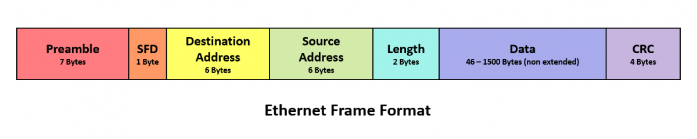
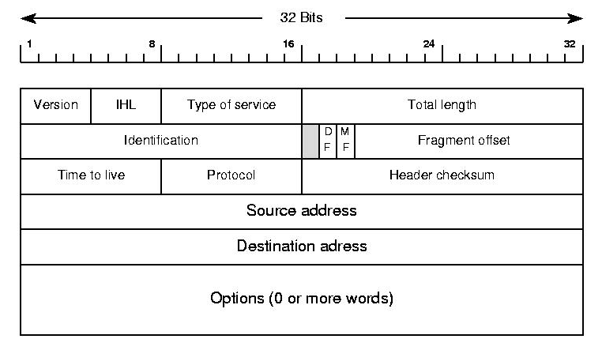

1 - Compare and contrast the Open Systems Interconnection (OSI) model layers and encapsulation concepts.
==========================================================================================================

**OSI model**
=============

The OSI Model is a conceptual model that describes the communication process between two networked devices. The OSI model stands for Open Systems Interconnection model, and it has seven layers, each with a specific function.

Breakdown
---------

Suppose you want to send an email to a colleague who works at a remote location. Here's how the communication would occur at each layer of the OSI model:

1.  **Physical Layer**: Your computer converts the email message into a stream of bits and sends it through its network interface card, which converts the bits into electrical signals and transmits them over a physical medium such as copper cable, fibre optic cable, or wireless frequency.
2.  **Data Link Layer**: Your computer's network interface card attaches the necessary headers and trailers to the bits to create a frame, which includes the source and destination MAC addresses. The frame is then sent over the physical medium.
3.  **Network Layer**: Your computer's network stack attaches the IP header to the frame, which includes the source and destination IP addresses, and the appropriate protocol such as TCP or UDP. The packet is then sent over the network to the next hop towards the destination.
4.  **Transport Layer**: The packet is received by the remote router, which strips off the IP header and forwards the packet to the destination device based on the destination IP address. The destination device then uses the transport layer protocol, such as TCP or UDP, to receive the packet and reassemble the data.
5.  **Session Layer**: The destination device establishes a session with the email server, which could use protocols such as SMTP, POP3 or IMAP. This session allows the email server to communicate with the destination device and send the email message.
6.  **Presentation Layer**: The email message is formatted and compressed using protocols such as MIME (Multipurpose Internet Mail Extensions) and encrypted using protocols such as SSL (Secure Sockets Layer).
7.  **Application Layer**: The email message is sent to the destination device using the email protocol, such as SMTP, and is then displayed to the recipient in their email client.

Data encapsulation is the process of adding headers and trailers to a block of data at each layer of the OSI model, in order to prepare it for transmission over the network. The headers and trailers contain information such as source and destination addresses, protocol type, and error checking information.

Here's an example of how data encapsulation occurs at each layer of the OSI model when sending an email:

-   Application Layer: The email message is created, and a header containing the destination email address is added to the message.
-   Presentation Layer: The email message is formatted and compressed, and a header containing the protocol type, such as SMTP or POP3, is added to the message.
-   Session Layer: A header containing the session ID is added to the message.
-   Transport Layer: A header containing the source and destination port numbers, and the protocol type, such as TCP or UDP, is added to the message.
-   Network Layer: A header containing the source and destination IP addresses, and the protocol type, is added to the message.
-   Data Link Layer: A header containing the source and destination MAC addresses, and error checking information, is added to the message.
-   Physical Layer: The message is converted into bits and transmitted over the physical medium.

Decapsulation is the opposite process of removing the headers and trailers at each layer of the OSI model, in order to extract the original data at the receiving end. This process happens in reverse order to encapsulation.

Here's an example of how decapsulation occurs at each layer of the OSI model when receiving an email:

-   Physical Layer: The bits are received and converted back into a message.
-   Data Link Layer: The header containing the source and destination MAC addresses, and error checking information, is removed from the message.
-   Network Layer: The header containing the source and destination IP addresses, and the protocol type, is removed from the message.
-   Transport Layer: The header containing the source and destination port numbers, and the protocol type, is removed from the message.
-   Session Layer: The header containing the session ID is removed from the message.
-   Presentation Layer: The header containing the protocol type, such as SMTP or POP3, is removed from the message, and the message is decompressed and formatted.
-   Application Layer: The header containing the destination email address is removed from the message, and the email message is displayed to the recipient.

Layer 1 - Physical
------------------

The Physical layer is responsible for transmitting raw bit streams over the physical medium, such as copper cables, fibre optic cables, or wireless frequencies. It defines the electrical, mechanical, and functional specifications for the physical connection between network devices.

Some important concepts to understand in the Physical layer include:

-   **Bandwidth**: The amount of data that can be transmitted over a network connection in a given amount of time.
-   **Transmission media**: The physical cables or wireless frequencies used to transmit data.
-   **Signal encoding**: The process of converting digital data into signals that can be transmitted over a network.
-   **Data transmission modes**: The different ways that data can be transmitted over a network, such as simplex, half-duplex, and full-duplex.
-   **Network topologies**: The physical layout of the network, such as bus, star, and mesh.

Some common protocols used at the Physical layer of the OSI model include:

-   Ethernet
-   SONET (Synchronous Optical Network)
-   Wi-Fi
-   Bluetooth

Layer 2 - Data Link Layer
-------------------------

The Data Link layer is responsible for organizing data into frames and ensuring the reliable delivery of those frames over a physical medium. It detects and corrects errors in the transmission, manages access to the physical medium, and establishes the link between two devices.

The Data Link layer is divided into two sublayers: the Logical Link Control (LLC) sublayer and the Media Access Control (MAC) sublayer. The LLC sublayer is responsible for providing a reliable link between devices regardless of the physical medium used. The MAC sublayer is responsible for managing access to the physical medium and ensuring that devices can communicate without interfering with each other.

Some important concepts to understand in the Data Link layer include:

-   **MAC addresses**: Unique hardware addresses assigned to each network device. These addresses are used to identify devices on the network.
-   **Ethernet**: A common LAN technology that uses the CSMA/CD (Carrier Sense Multiple Access with Collision Detection) access method to transmit data.
-   **Switching**: The process of forwarding frames to the correct destination device based on its MAC address.
-   **ARP**: The Address Resolution Protocol is used to map IP addresses to MAC addresses on a network.
-   **Frame relay**: A WAN technology that uses virtual circuits to transmit data between devices.

Some common protocols used at the Data Link layer of the OSI model include:

-   ARP (Address Resolution Protocol)
-   PPP (Point-to-Point Protocol)
-   Ethernet (IEEE 802.3)
-   HDLC (High-level Data Link Control)

Layer 3 - Network
-----------------

The Network layer is responsible for routing data packets between networks, enabling communication across multiple devices and networks. It selects the most efficient route for data transmission, manages congestion, and controls the flow of data.

Some important concepts to understand in the Network layer include:

-   **IP addresses**: Unique addresses assigned to each network device to identify it on the network.
-   **Routing**: The process of selecting the best path for data to travel between networks.
-   **Routing protocols**: Protocols used by routers to exchange information about network topology and determine the best path for data to travel.
-   **Subnetting**: Dividing a larger network into smaller subnetworks for better management and organization.
-   **CIDR (Classless Inter-Domain Routing)**: A method of assigning IP addresses that allows for more efficient use of IP address space.
-   **NAT** (Network Address Translation): A technique used to map public IP addresses to private IP addresses to allow devices on a private network to access the Internet.
-   **IPv6**: The latest version of the Internet Protocol, designed to replace IPv4 and provide a larger address space.

Some common protocols used at the Network layer of the OSI model include:

-   IP (Internet Protocol)
-   ICMP (Internet Control Message Protocol)
-   OSPF (Open Shortest Path First)
-   BGP (Border Gateway Protocol)

Layer 4 - Transport
-------------------

The Transport layer is responsible for providing end-to-end communication between devices, ensuring the reliable delivery of data. It segments data into smaller packets, manages the transmission order, and retransmits lost or corrupted packets.

Some important concepts to understand in the Transport layer include:

-   **TCP (Transmission Control Protocol)**: A connection-oriented protocol that provides reliable data delivery, retransmission of lost packets, and flow control to prevent network congestion.
-   **UDP (User Datagram Protocol)**: A connectionless protocol that provides unreliable data delivery without any retransmission or flow control mechanisms.
-   **Ports**: Numbers used by the Transport layer to identify different application processes on a device.
-   **Socket**: A combination of an IP address and port number used to establish a connection between two devices.
-   **Three-way handshake**: The process used by TCP to establish a connection between two devices.
-   **Windowing**: The process used by TCP to control the amount of data that can be transmitted at once.
-   **Congestion control**: The process used by TCP to prevent network congestion by slowing down the transmission rate when necessary.

Some common protocols used at the Transport layer of the OSI model include:

-   TCP (Transmission Control Protocol)
-   UDP (User Datagram Protocol)
-   SCTP (Stream Control Transmission Protocol)
-   DCCP (Datagram Congestion Control Protocol)

Layer 5 - Session
-----------------

The Session layer is responsible for establishing and managing communication sessions between applications. It manages the start and end of the sessions, as well as checkpointing and recovery in case of failures.

Some important concepts to understand in the Session layer include:

-   **Session**: A period of communication between two devices, such as a login session or a file transfer session.
-   **Session ID**: A unique identifier assigned to each session to keep track of the session state.
-   **Checkpointing**: The process of creating a backup of session data at certain points in time, so that if there is a failure, the session can be resumed from the last checkpoint.
-   **Recovery**: The process of resuming a session from the last checkpoint in case of a failure.
-   **NetBIOS**: A session layer protocol used by Microsoft Windows to establish communication between applications.
-   **RPC** (Remote Procedure Call): A session layer protocol used to enable applications to communicate with each other on different devices.
-   **SQL** (Structured Query Language): A session layer protocol used for database management and communication between applications and databases.

Some common protocols used at the Session layer of the OSI model include:

-   NetBIOS (Network Basic Input/Output System)
-   RPC (Remote Procedure Call)
-   SQL (Structured Query Language)
-   NFS (Network File System)

Layer 6 - Presentation
----------------------

The Presentation layer is responsible for translating data between different formats and character sets. It manages data encryption and decryption, data compression, and data formatting for different applications.

Some important concepts to understand in the Presentation layer include:

-   **Encryption**: The process of converting plaintext data into ciphertext to ensure confidentiality.
-   **Decryption**: The process of converting ciphertext data back into plaintext.
-   **Compression**: The process of reducing the size of data to save bandwidth and storage space.
-   **ASCII (American Standard Code for Information Interchange)**: A character encoding standard used to represent text data in computers.
-   **Unicode**: A character encoding standard that can represent a much larger range of characters and scripts than ASCII.
-   **JPEG (Joint Photographic Experts Group)**: A presentation layer protocol used for compressing digital images.
-   **MPEG (Moving Picture Experts Group)**: A presentation layer protocol used for compressing digital audio and video.

Some common protocols used at the Presentation layer of the OSI model include:

-   ASCII (American Standard Code for Information Interchange)
-   JPEG (Joint Photographic Experts Group)
-   MPEG (Moving Picture Experts Group)
-   SSL (Secure Sockets Layer)

Layer 7 - Application
---------------------

The Application layer is responsible for providing services to end-users, such as email, file transfer, and web browsing. It enables application-level protocols to communicate with other applications, handles user authentication, and manages user interfaces.

Some important concepts to understand in the Application layer include:

-   **HTTP (Hypertext Transfer Protocol)**: A protocol used for transmitting web pages and other data over the Internet.
-   **SMTP (Simple Mail Transfer Protocol)**: A protocol used for sending email messages between devices.
-   **FTP (File Transfer Protocol)**: A protocol used for transferring files between devices.
-   **DNS (Domain Name System)**: A protocol used to map domain names to IP addresses on a network.
-   **DHCP (Dynamic Host Configuration Protocol)**: A protocol used to assign IP addresses and other network configuration information to devices on a network.
-   **POP3 (Post Office Protocol version 3)**: A protocol used for retrieving email messages from a mail server.
-   **IMAP (Internet Message Access Protocol)**: A protocol used for retrieving and managing email messages on a mail server.
-   **SNMP (Simple Network Management Protocol)**: A protocol used for managing and monitoring network devices.

Some common protocols used at the Application layer of the OSI model include:

-   HTTP (Hypertext Transfer Protocol)
-   SMTP (Simple Mail Transfer Protocol)
-   FTP (File Transfer Protocol)
-   DNS (Domain Name System)

**Data encapsulation and decapsulation within the OSI model context**
=====================================================================

Ethernet header
---------------

An Ethernet header is a set of fields that are added to a data frame at the Data Link layer of the OSI model when using Ethernet as the networking technology. The Ethernet header contains information about the source and destination MAC addresses of the devices involved in the communication, as well as the type of protocol being used.

Here are the key fields of an Ethernet header:

-   **Preamble**: A sequence of alternating 0s and 1s that signals the start of a frame and helps the receiving device synchronize with the transmission.
-   **Destination MAC address**: The MAC address of the device to which the frame is being sent.
-   **Source MAC address**: The MAC address of the device sending the frame.
-   **EtherType**: A 2-byte field that indicates the type of protocol being used in the frame, such as IPv4 or IPv6.
-   **Payload**: The actual data being transmitted.

The Ethernet header is important because it provides information about the source and destination devices involved in the communication, and allows devices to identify and process the frames correctly. The MAC addresses in the header are used by the switches and other networking devices to determine where to forward the frames, while the EtherType field is used by devices to identify the type of protocol being used in the frame.

Ethernet headers are used in a variety of networking technologies, including Ethernet over copper, Ethernet over fiber, and Ethernet over wireless.

Internet Protocol (IP) header
-----------------------------

An IP header is a set of fields that are added to a packet at the Network layer of the OSI model when using the Internet Protocol (IP) as the networking protocol. The IP header contains information about the source and destination IP addresses of the devices involved in the communication, as well as other information such as packet length, time-to-live, and protocol type.

Here are the key fields of an IP header:

-   **Version**: Indicates the version of the IP protocol being used.
-   **Header Length**: Indicates the length of the IP header in 32-bit words.
-   **Type of Service (TOS)**: A field used to specify the quality of service required for the packet.
-   **Total Length**: The length of the entire IP packet, including header and data.
-   **Identification**: A unique identifier for the packet that is used to reassemble fragmented packets.
-   **Flags**: A 3-bit field used to indicate whether the packet can be fragmented, whether it is a fragment, and whether it is the last fragment.
-   **Fragment Offset**: The offset of the current fragment relative to the beginning of the original packet.
-   **Time-to-Live (TTL)**: A field that specifies the maximum number of router hops the packet can make before it is discarded.
-   **Protocol**: Indicates the type of protocol used in the packet, such as TCP, UDP or ICMP.
-   **Header** Checksum: A checksum value calculated over the entire IP header to detect errors.
-   **Source IP address**: The IP address of the device sending the packet.
-   **Destination IP address**: The IP address of the device to which the packet is being sent.
-   **Options**: An optional field that contains additional information such as security or routing information.

The IP header is important because it provides information about the source and destination devices involved in the communication, as well as the protocol being used. The IP addresses in the header are used by routers and other networking devices to forward the packet to the correct destination. The TTL field is used to prevent packets from circulating indefinitely in the network, while the checksum value helps to detect errors in the header.

Transmission Control Protocol (TCP)/ User Datagram Protocol (UDP) headers
-------------------------------------------------------------------------

Transmission Control Protocol (TCP) and User Datagram Protocol (UDP) are transport layer protocols used to send data across a network. Both protocols add a header to the data segment before transmitting it, which contains important information about the data being transmitted.

Here are the key fields of a TCP header:

-   **Source Port**: The port number used by the sending device.
-   **Destination Port**: The port number used by the receiving device.
-   **Sequence Number**: The sequence number of the first byte in the data segment.
-   **Acknowledgment Number**: The sequence number of the next byte expected from the other device.
-   **Data Offset**: The length of the TCP header in 32-bit words.
-   **Reserved**: Reserved for future use.
-   **Flags**: Control flags that indicate the purpose of the segment, such as whether it contains data, whether it is a SYN or FIN segment, or whether it is an ACK segment.
-   **Window Size**: The amount of data that the sending device is willing to receive before sending an acknowledgement.
-   **Checksum**: A checksum value calculated over the entire TCP segment to detect errors.
-   **Urgent Pointer**: Indicates whether the data segment contains urgent data.

Here are the key fields of a UDP header:

-   **Source Port**: The port number used by the sending device.
-   **Destination Port**: The port number used by the receiving device.
-   **Length**: The length of the entire UDP segment, including the header and data.
-   **Checksum**: A checksum value calculated over the entire UDP segment to detect errors.

The TCP and UDP headers are important because they provide information about the source and destination ports, sequence numbers, and other control flags that are used to establish and maintain connections between devices. The port numbers are used to identify the application that is sending or receiving the data. The sequence numbers and acknowledgement numbers are used to ensure that data is transmitted and received in the correct order, while the control flags help to manage the flow of data between devices.

TCP flags
---------

TCP (Transmission Control Protocol) uses control flags to indicate the purpose of each TCP segment that is transmitted between devices. These flags are used to establish and maintain connections, manage data flow, and provide error control.

Here are the most common TCP flags and their meanings:

-   **URG (Urgent)**: Indicates that the Urgent Pointer field is valid and that the data segment contains urgent data.
-   **ACK (Acknowledgment)**: Indicates that the Acknowledgment Number field is valid and that the device has received data up to that point.
-   **PSH (Push)**: Indicates that the device should send all buffered data to the receiving device immediately, rather than waiting for a full buffer.
-   **RST (Reset)**: Indicates that the connection is being reset and that all outstanding data should be discarded.
-   **SYN (Synchronize)**: Indicates that the device is attempting to establish a new connection.
-   **FIN (Finish)**: Indicates that the device has no more data to transmit and that the connection should be closed.

TCP flags are important because they help to manage the flow of data between devices, establish and terminate connections, and provide error control.

Payload
-------

The payload is the actual data that is being transmitted over a network at the Application layer of the OSI model. The payload can consist of any type of data, such as email messages, web pages, audio and video files, and more.

In networking, the payload is the data that is transmitted in the form of packets or frames, and it is encapsulated in headers and trailers at lower layers of the OSI model, such as the Transport layer, Network layer, and Data Link layer. The headers and trailers provide information about the source and destination of the data, the type of protocol being used, and error checking information.

For example, if you are sending an email message, the payload would be the actual text of the email message itself, while the headers and trailers would contain information about the source and destination email addresses, the protocol being used (SMTP, POP3, or IMAP), and other information.

The payload is important because it is the actual data that is being transmitted between devices.

Maximum transmission unit (MTU)
-------------------------------

Maximum Transmission Unit (MTU) is the largest size of a packet that can be transmitted over a network. The MTU is determined by the underlying physical layer technology used in the network, such as Ethernet or Wi-Fi.

The MTU size includes the packet header, payload, and any trailers that are added to the packet at the lower layers of the OSI model. When a packet is larger than the MTU of the network, it must be fragmented into smaller packets before transmission.

The MTU size can have a significant impact on network performance. When a device wants to send a packet larger than the MTU size, it must fragment the packet into smaller packets, which increases the overhead on the network and reduces the available bandwidth. This can cause network congestion, packet loss, and slower transmission speeds.

In addition, the MTU size can also affect the performance of certain applications, such as virtual private network (VPN) connections, which may require specific MTU sizes in order to function properly.

Questions & Answers
===================

-   What is the OSI Model and why is it important in networking?

    The OSI (Open Systems Interconnection) Model is a conceptual framework that describes how data is transmitted over a network. It is important in networking because it helps to standardize communication between different devices and networks, and provides a framework for troubleshooting network issues.

-   What are the seven layers of the OSI Model, and what is the function of each layer?

    The seven layers of the OSI Model, from top to bottom, are: Application, Presentation, Session, Transport, Network, Data Link, and Physical. Each layer has a specific function related to transmitting data over the network, such as data formatting, error checking, and protocol selection.

-   What is data encapsulation, and how does it relate to the OSI Model?

    Data encapsulation is the process of adding headers and trailers to data at each layer of the OSI Model to prepare it for transmission over the network. The headers and trailers contain information such as source and destination addresses, protocol type, and error checking information.

-   What is the difference between TCP and UDP, and in which layer of the OSI Model are they used?

    TCP (Transmission Control Protocol) and UDP (User Datagram Protocol) are transport layer protocols used to send data across a network. TCP provides reliable, ordered, and error-checked delivery of data, while UDP provides faster, unordered, and unreliable delivery. Both protocols use the Transport layer of the OSI Model.

-   What is the MTU, and why is it important in networking?

    The MTU (Maximum Transmission Unit) is the largest size of a packet that can be transmitted over a network. The MTU is important in networking because it affects network performance and can cause issues with packet fragmentation, network congestion, and slower transmission speeds.

-   What is a protocol, and how does it relate to the OSI Model?

    A protocol is a set of rules and procedures that govern the transmission of data over a network. Protocols are used at each layer of the OSI Model to ensure reliable and efficient transmission of data between devices and networks.

-   What is a header, and in which layers of the OSI Model are headers added to data?

    A header is a block of information that is added to data at each layer of the OSI Model to provide information about the source and destination of the data, the type of protocol being used, and error checking information. Headers are added at the Transport, Network, Data Link, and Physical layers of the OSI Model.

-   What is a payload, and why is it important in networking?

    The payload is the actual data that is being transmitted over a network at the Application layer of the OSI model. The payload is important because it is the actual data that is being transmitted between devices, and understanding the payload can help Network Engineers diagnose and troubleshoot network issues related to the Application layer.

-   What is a MAC address, and in which layer of the OSI Model is it used?

    A MAC (Media Access Control) address is a unique identifier assigned to each network interface controller (NIC) for use on a network. MAC addresses are used at the Data Link layer of the OSI Model to identify devices on a local network.