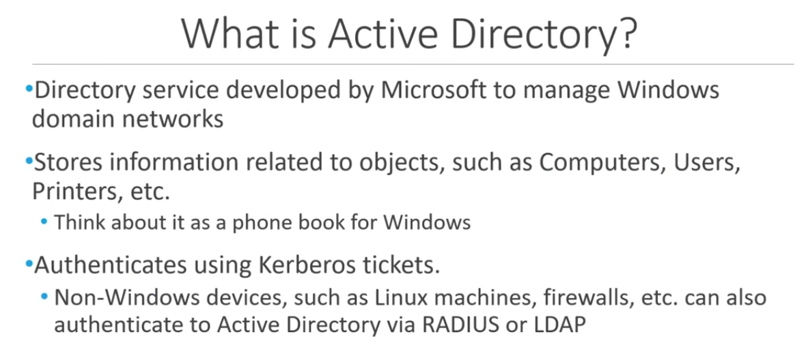
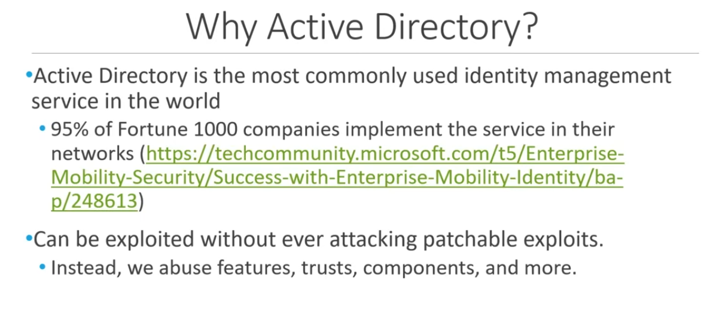

### What is Active Directory?



### Why Active Directory?



---

## Lab Setup Info

### Domain Controller

**Install**
- Standard Evaluation (Desktop Edition)
- Custom Install
- Choose Drive
	- New
	- Apply

**Customise Settings**
- Choose password. For this lab we choose `P@ssw0rd!`
```sh
P@ssw0rd!
```

To unlock use the VirtualBox to send the machine `CTRL+ALT+DEL`

We can now login with the new password. 

Install Guest Additions (check PHDA if you forget).

**Change PC name**
- View your PC name
- Rename this PC: for the lab we choose HYDRA-DC
- Restart

**Add roles**
- Manage
- Add roles and features
- Role based or feature based installation
- Add server roles
	- Active directory domain services
	- Add features
- On the final screen select the top box
	- Restart the destination server automatically
- Install
- Click on the blue text to
	- Promote this server to a domain controller

**Setup as domain controller**
- Add new forest
- Add root domain name
	- MARVEL.local
- Give it a password. We can choose the same password as we used before: P@ssw0rd!
- Install
- Restart (should be automatic).
- 
---
### User Machine

Press anykey to boot into windows after setting up the VM.

**Install**
- Standard Evaluation (Desktop Edition)
- Custom Install
- Choose Drive
	- New
	- Apply

**Account**
- Do not sign in with microsoft, instead we select the option to
	- Domain join instead
- Choose name: Frank Castle
- Choose password
```sh
Password1
```
- Pick security questions (input anything)
- Turn off all the added privacy settings

**Install VirtualBox guest utils** 
- Try using the fast way - devices insert guest additions CD image
- else: in the server, click folder to get access to the CD drive
- right click and run as admin VBoxWindowsEditions-amd64 
- Reboot machine
- Adjust window size on virtualbox and make sure Auto-Resize Guest Display is enabled
- Using fullscreen: right control + f
- Optionally, take a snap shot to save progress

**Change PC name**
- View your PC name
- Rename this PC: for the lab we choose THEPUNISHER
- Restart

---
## Setup Users, Groups, and Policies

**Login to the DC**

**Select tools**
- Active directory users and computers
- Open MARVEL.local

**Make new group**
- Right click MARVEL.local 
- New organisational unit
- Call it Groups and click OK
- Move all default groups out of the Users and put them into Groups
- That should just leave Administrator and Guest left in Users

**Make new Users**
- Right click inside where the users are and select new user
- Fill in the details
	- First Name: Frank
	- Last Name: Castle
	- User Logon Name: fcastle
	- Next
	- Pick password
```sh
Password1
```
- Set password never expires

Right click and copy Admin account:
- Fill in the details
	- First Name: Tony
	- Last Name: Stark
	- User Logon Name: tstark
	- Next
	- Pick password
```sh
Password2019!
```
- Set password never expires

Right click and copy Frank Castle account:
- Fill in the details
	- First Name: Peter
	- Last Name: Parker
	- User Logon Name: pparker
	- Next
	- Pick password
```sh
Password2
```
- Set password never expires

Create fake SQL account. Right click Tony Stark to make another domain admin:
- Fill in the details
	- First Name: SQL
	- Last Name: Service
	- User Logon Name: SQLService
	- Next
	- Pick password
```sh
MYpassword123#
```
- Set password never expires
- Service accounts should **NOT** be domain admin accounts!
- Double click the SQL account to open options
- Add the password of the service account in the description:
	- Description: Password is MYpassword123#
	- Click apply

**Setup a file share** 
- File and storage services (on the far left)
- Shares
- On the tasks drop down click new share
- SMB share - quick
- Share Name: hackme
- Use default options for everything else
- Create and close

This opens up ports 139 and 445 so that we have SMB enabled on the DC.

**Create SPN (Service Principle Name)**
- Open as admin a CMD prompt 
```cmd
setspn -a HYDRA-DC/SQLService.MARVEL.local:60111 MARVEL\SQLSevrvice
```

Check it's set
```cmd
setspn -T MARVEL.local -Q */*
```
- Should show at the bottom of the output

**Group policy management**
- Search and right click to open as admin
- Open Domains > MARVEL.local
- Right click and create a GPO in this domain
	- Call it: Disable Windows Defender

For this lab, we will disable WD as we work through the AD techniques and tools. Why are we not using AV evasion? AV evasion will be updated regularly, so what's in the course might not work at a later stage.     
- Right click on the new policy and select edit
- Computer config > policies > administrative templates > windows components > windows defender antivirus (close to the bottom of the list) 
- On the right you should see an option to turn off windows defender antivirus
- Double click and make sure it's enabled, then click apply, and okay
- Right click the policy and select enforced

---
## Join Machines to the Domain

**Setup share on the machine**
File Explorer
- This PC
- Click on the C drive
- Right click to crate a new folder and name it Share
- Right click the new share folder
	- Properties
	- Sharing
	- Select the share option
	- You don't need to select anything just hit the share button to select everything
	- Yes to turn on network discovery
	- Done

**Join Domain**
Get the IP of the domain controller by opening a CMD prompt 
```cmd
ipconfig
```

Open network and internet settings by right clicking the internet icon in the windows tray (bottom right)

Change adaptor options
- Right click and select properties on Ethernet0
- Double click IPv4
- Add the DC IP to the use DNS address 

Search again for domain
- Select access work or school
- Connect
- Join device to an active directory domain
- Enter domain name: MARVEL.local
- Enter info:
	- Name: Administrator
	- Password: P@ssw0rd!
- Skip the account type selection feature
- Restart

Now we can login as the user fcastle.
Name:
```sh
fcastle
```

Password:
```sh
Password1
```

**Sign in as admin to make a few more changes**

```sh
marvel\administrator
```

Password:
```sh
P@ssw0rd!
```

Enable Frank Castle to be a local admin

Right click > computer management
- Local users and groups
- Groups
- Double click administrators 
- Select add to add a user as a local admin
	- Type fcastle and use check names to finish the name off
	- Apply and okay

If you have another machine which would be Peter Parker's computer, you would now do the same steps, making Frank Castle a local admin on that machine as well as Peter Parker. 

Peter Parker's computer would be named SPIDERMAN. 

I don't have the CPUs to run everything so i'll have to use just the one machine: THEPUNISHER, for now. 

--- 

**Make sure the updates are on**
```cmd
gpupdaate /force
```

**Optional:**

**Turn off automatic updates**
Edit group policy:
- Policies
- Administrative templates
- Windows components
- Windows updates
- Set "Configure Automatic Updates" to "Disabled"

**Turn off real time protection**
Edit group policy:
- Administrative templates
- Windows components
- Microsoft defender antivirus
- Real-time protection
- Set "Turn off real-time protection" to "Enabled"

