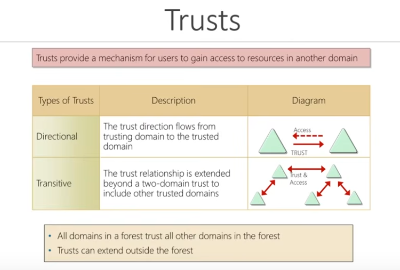

### AD DS Schema

### Domains

### Trees

### Forests

### Organisational Units (OUs)

### Trusts

### Objects

Following this is building the AD lab, which is already covered in Extra > CyberMentor > Practical Help Desk.