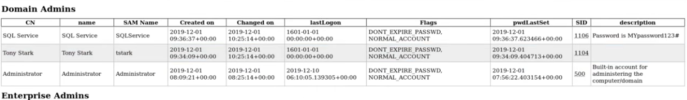
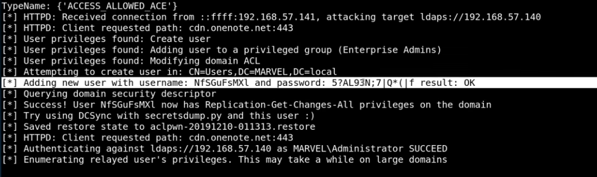
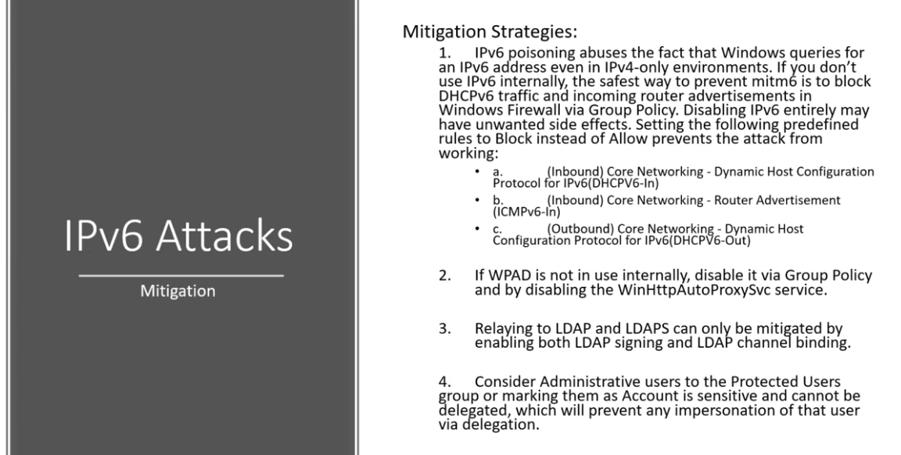

### IPv6 Attacks 

An issue with IPv6 is that it's usually turned on but it doesn't have a set DNS. An attacker can act as the DNS and route the traffic to the Domain Controller, leaking the authentication via LDAP or SMB.
When this happens:
- If we reboot a machine, it causes an event, the even comes through to the attacker, and the attacker can use that to login to the Domain Controller.The account doesn't have to be an admin.
- We can use the victim machine to create another machine and use that to login.
- Wait for someone to login and that comes to the attacker machine in the form of NTLM. That can then be used to do LDAP relaying using LTLMRelayX. I the account is an administrator MITM6 will create a user for us, and we can login with that

Tools: 
MITM6 https://github.com/dirkjanm/mitm6
- Pip3 can break the install so use pip2
- NTLMRelayX is part of MITM6 

**Lab Updates** 

Add the certificate services feature (covered in the PHDA). Using all the default options. 

Starting up MITM6
```sh
mitm6 -d marvel/local 
```

Start NTLMRealyX
```sh
ntlmrelayx.py -6 -t ldaps://<target-ip> -wh fakewpad.marvel.local -l lootme
```
- 6 - targeting IPv6
- LDAPS - LDAP Secure. This is why we installed the certificate. Most run LDAP as well. 
- WPAD - Web Proxy Auto Discovery Protocol 
- l - Loot. Dumps information.

Now to see this in action we need to reboot the Windows workstation. IPv6 is sending out a reply asking whose got my DNS? Which happens about every 30mins, but we can speed it up by rebooting. 

Sensitive infor will be dumped into the lootme folder that we set earlier. We can use firefox to open whatever we want to look at, for example:
```sh
firefox domain_users_by_group.html
```

If anyone added a password reminder in their description it will be visible here.



Once the admin user logs in, MITM6 will attempt to create a new user for us. 



This also creates a restore that you can use to reset the ACL that will look similar to thiis: aclpwn-57847593-74835673-restore.

Resources: https://dirkjanm.io/worst-of-both-worlds-ntlm-relaying-and-kerberos-delegation/

---
### Mitigation



