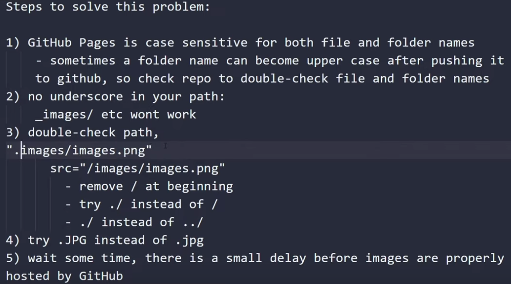

![[./img/git-image.png]]

Try to change ‘New link format’ to ‘Relative path to file’ in Obsidian and disable wikilink.

**Website**

If you save your image inside a folder. Then you will have to access your image by following the pattern: _./folder_name/image_name_ or remove the _./_ completely: _folder_name/image_name_

If you save your image inside a folder of a folder. Then you will have to access your image by following the pattern:  _./folder_name/folder_name/image_name_

However, if your html file is in one folder and your images or css files are in another folder. Then you will have to access your image by following the pattern: ../folder_name/image_name



After asking co-pilot it gave me the correct answer:

The issue with the image not showing up in the Markdown file is due to the syntax used for embedding the image. The current syntax `![[./img/git-image.png]]` is not standard Markdown syntax for images. Instead, you should use the standard Markdown image syntax like this:

```markdown

```

So, update the first line of your `obsidian/Extra/Git Install/Git Images Fix.md` file to:

```markdown

```

This should resolve the issue of the image not showing up.

I'll leave the broken image in, for future reference. 