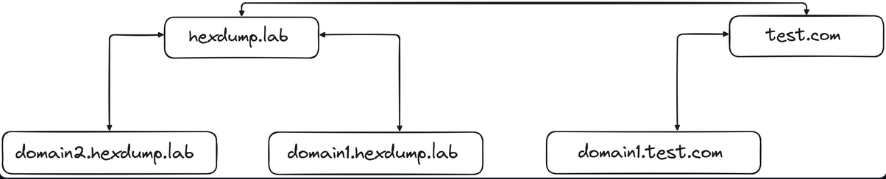
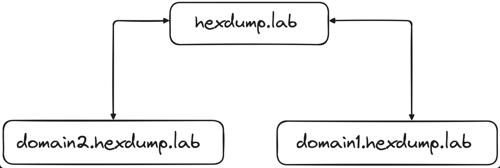

## What is Active Directory?

**Active Directory** (AD) is a service developed by Microsoft for managing and organising the resources within a network, such as users, computers, and other devices. It provides a centralized way to manage and secure large-scale IT environments.

The core services provided by Active Directory are:

  - `Authentication'

    Verifying user identities through different means.

  - `Authorization'

    Ensuring users have the right permissions to access resources
    (files, applications, etc.).

  - `Directory Services'

    Organizing and managing network resources (users, computers, groups)
    and access policies in a centralized directory.

An AD network can be adapted to support many different services and technologies:

  - Certificate Services (AD CS)
  - Federation Services (AD FS)
  - Lightweight Directory Services (LDS)
  - Rights Management Services (RMS)
  - Domain Name System Integration (DNS)

## Components of Active Directory

Since AD is a complex system made up of multiple components interacting with eachothers, it is important to understand the role of each component.

**Domain Controllers (DC)**

Domain Controllers are a fundamental part of active directory.

They are used for many different tasks, including:

  - User Authentication
  - Storing Active Directory data
  - Managing and enforcing security policies
  - Processing of directory queries.

In the context of big domains, there are multiple DCs in a domain to provide `redundancy` and `load balancing`. These DCs replicate data among themselves so that if one DC fails, the AD information is not lost.

**Domain Admins**

Members of the `Domain Admins` group have administrative privileges within a specific domain.

That is, they have complete control over the domain and can change the domain's configuration and security settings.
```powershell
PS C:\Users\Administrator> net user administrator
User name                    Administrator
Full Name
Comment                      Built-in account for administering the computer/domain
User's comment
Country/region code          000 (System Default)
Account active               Yes
Account expires              Never
...
Local Group Memberships      *Administrators
Global Group memberships     *Schema Admins        *Domain Admins
*Domain Users                *Group Policy Creator
                             *Enterprise Admins
```

There is actually a higher-privilege group which is known as the `Enterprise Admins`, which has control over an entire forest.

**Group Policy Objects (GPOs)**

`Group Policy` is a feature that allows administrators to define settings and enforce policies across users and computers in an AD domain.

---

Specifically, `Group Policy Objects` (GPOs) are collections of settings that define how various aspects of the network environment should behave, ranging from user desktop configurations to security settings.

Some examples:

  - Password Policies

    Forcing users to use complex passwords and enforcing password
    expiration.

  - User Rights Assignments

    Defining which users or groups can log on locally or shut down the
    system.

  - Software Restrictions

    Controlling which applications can be executed on domain-joined
    systems.

  - Security Options

    Configuring things like account lockout policies, Kerberos settings,
    or audit policies.

---

GPOs are applied at different levels:

  - Local

    A single system (computer)

  - Site

    A geographical location or network segment

  - Domain

    All systems within a domain

  - Organizational Unit (OU)

    Specific groups or collections of systems and users within the AD
    structure

It is also possible to apply a GPO to a specific security groups using `Security Filtering`.

---

To edit GPOs, you can use the `Group Policy Management` feature and the GPMC console, which allows you to create, manage and apply GPOs to different parts of the AD structure.

Win + R
```cmd
gpmc.msc
```

Since GPOs are applied during the regulary policy refresh interval (around every 90 minutes), you can force the new update as follows

```cmd
gpupdate /force
```

**Organizational Units (OUs)**

OUs are containers within a domain used to organise AD objects, such as users, computers, and groups. They can be used when structuring an active directory so as to reflect the organisation's needs and hierarchy.

To create a new Organisational Unit (OU) you can use the the `Active Directory Users and Computers` (ADUC) tool.

Win + R
```cmd
dsa.msc
```

For example, to create a new OU named "employees", you can do as follows:
> Right-click on "hexdump.lab" -> New
>  -> Organisational Unit
>  -> Write "employees"
>  -> OK

There are different advantages in using OUs:

  - With OUs it is possible to implement an access-control based on roles, as OUs can act as security boundaires, allowing to implement the `least privilege' principle.

  - GPOs can be applied to specific OUs, which override domain-level policies and therefore can be used for deep customisation.

  - OUs can be organised in an hierarchical structure, where OUs inherit settings from their parent OUs. It is also possible to block this default inheritance behaviour.

**Lightweight Directory Access Protocol (LDAP)**

LDAP is the protocol used to query and interact with the directory service that stores information about the Active Directory (users, groups, computers, printers, etc..).

In the context of Active Directory, LDAP allows clients and administrators to access and manage the information of an AD network.

  Specifically, it can be used for:

  - Authentication and Authorization
  - Directory Browsing
  - Administrative Tasks over the domain

  Queries in LDAP look as follows
```cmd
(&(objectClass=user)(sAMAccountName=leo))
```

These queries can be executed within powershell:
```powershell
Import-Module ActiveDirectory
```


```powershell
Get-ADUser -LDAPFilter "(&(objectClass=user)(sAMAccountName=leo))"
```

**Kerberos**

Kerberos is a network authentication protocol that provides a secure method for authentication using centralized server.

It was developed at MIT around 1988 and adopted by Active Directory for authentication purposes.

Kerberos is a *ticked-based authentication system* that uses a trusted third party known as the **Key Distribution Center (KDC)** to verify the identity of users and services in the network.

In the context of AD, the KDC is implemented as part of the Domain Controller, which is responsible for authenticating users and issuing tickets that are used accessing the resources of the domain.

User accounts in AD are linked to *Kerberos principals*. In kerberos, a principal is an *identity* that can be authenticated. Each principal has a unique name, and Kerberos issues tickets to these principals.

To see the Kerberos tickets associated with your user, run the following.
```powershell
klist tickets
```

**NTDS.dit**

The `NTDS.dit` file represents the core database where all the information about the Active Directory is stored.

> NTDS.DIT -> New
> Technology
> Directory
> Services
> Directory
> Information
> Tree

Specifically, it contains the entire structure of the domain, including domain-wide settings, security policies, password hashes, and the replication data needed for multiple domain controllers.

It is usually stored in a specific directory within the domain controller.
```cmd
C:\Windows\NTDS\ntds.dit
```

**SYSVOL (System Volume)**

SYSVOL (System Volume) is a shared folder on domain controllers in Active Directory (AD) that stores and replicates important system data across all domain controllers in a domain.

Specifically, it contains also the following things:

  - *GPO Files*
  - *Scripts*

  SYSVOL must be consistently replicated across domain controllers to ensure uniform application of policies and scripts. Changes made in the SYSVOL directory are replicated across domain controllers using

  - File Replication Service (FRS) (in older versions of Windows Server)
  - Distributed File System Replication (DFSR) (in newer versions).

**Global Catalog**

The `Global Catalog` (GC) is a distributed data store in AD that contains a partial replica of every object in the AD forest. It helps in fast searching across all domains in the forest and is essential for user logins, especially in multi-domain environments.

## Domains, Forests and Trust

Within Active Directory, there is an important distinction between `Domains` and `Forests`.

  - Domains

    A domain is a logical grouping of objects (users, computers, groups) and is a core administrative unit in AD.

    Each domain has its own Security Accounts Manager (SAM) database, and within a domain, authentication, policies, and group memberships are centralised.

  - Trees

    Tree is a collection of domains that are connected in a hierarchical structure using a contiguous namespace.

    A domain tree represents an ordered group of domains that share a common root domain. All domains within the tree are linked together using a trust relationship and share a common namespace.

    This means that all domains within a tree are part of the same DNS domain structure

    - hexdump.lab
    - domain1.hexdump.lab
    - domain2.hexdump.lab

  - Forests

    The forest is the highest level of the AD hierarchy and represents the entire directory structure.

    A forest can contain one or more domains, but all domains within a forest share a common schema and a Global Catalog (GC).

    Each forest has at least one domain, and domains within a forest can be part of a trust relationship, allowing users from one domain to access resources in another.

---

Graphically we have the following examples:

Forrest:



Tree:



**Trust Relationships**

Trusts are ways to establish relationships between different AD domains or AD forests.

Trusts allow users in one domain to access resources in another domain, simplifying cross-domain authentication and resource sharing.

There are various types of trusts
  - two-way trusts
  - one-way trusts
  - external trusts
  - and forest trusts.