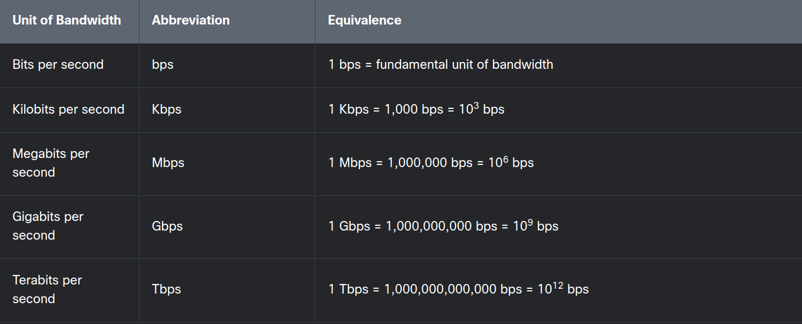

1.3.1 Bandwidth

Different physical media supports different speeds, usually discussed in terms of bandwidth and throughput.

1.3.2 Throughput

Like bandwidth, throughput is the measure of the transfer of bits across the media over a given period of time. However, due to a number of factors, throughput does not usually match the specified bandwidth. Many factors influence throughput including:

- The amount of data being sent and received over the connection
- The types of data being transmitted
- The latency created by the number of network devices encountered between source and destination

Latency refers to the amount of time, including delays, for data to travel from one given point to another.

Throughput measurements do not take into account the validity or usefulness of the bits being transmitted and received. Many messages received through the network are not destined for specific user applications. An example would be network control messages that regulate traffic and correct errors.

In an internetwork or network with multiple segments, throughput cannot be faster than the slowest link of the path from sending device to the receiving device. Even if all or most of the segments have high bandwidth, it will only take one segment in the path with lower bandwidth to create a slowdown of the throughput of the entire network.

There are many online speed tests that can reveal the throughput of an internet connection.

---

The capacity of the medium to carry data is known as:
_bandwidth_

Which of the following measurements includes any latency encountered during data transmissions?
_throughput_

Which of the following measurements includes any latency encountered during data transmissions?
_bits per second_

