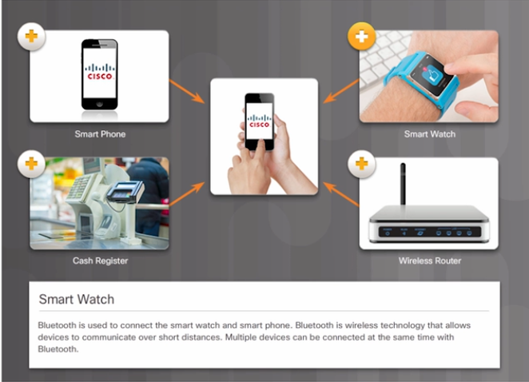
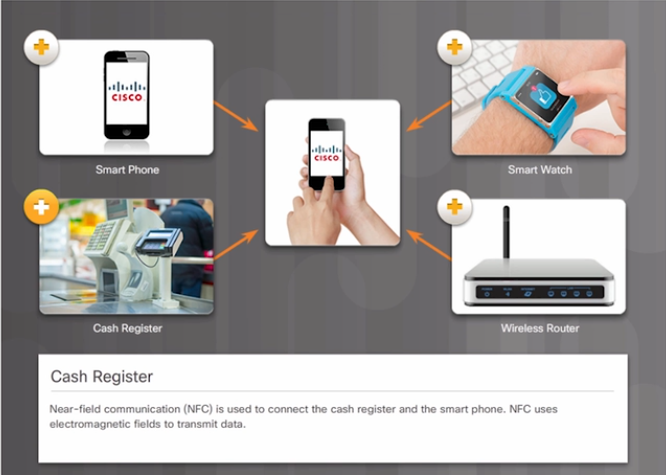

## Cellphone Network types

Cellphones communicate on many different types of networks. When we talk using the voice channel, our communication is going through the cellular provider network.

When we use a Bluetooth device, that is a completely different network.

**Bluetooth**

**WiFi**

**Near-Field Communication (NFC)**

A cellphone is also capable of receiving GPS signals from satellites. 