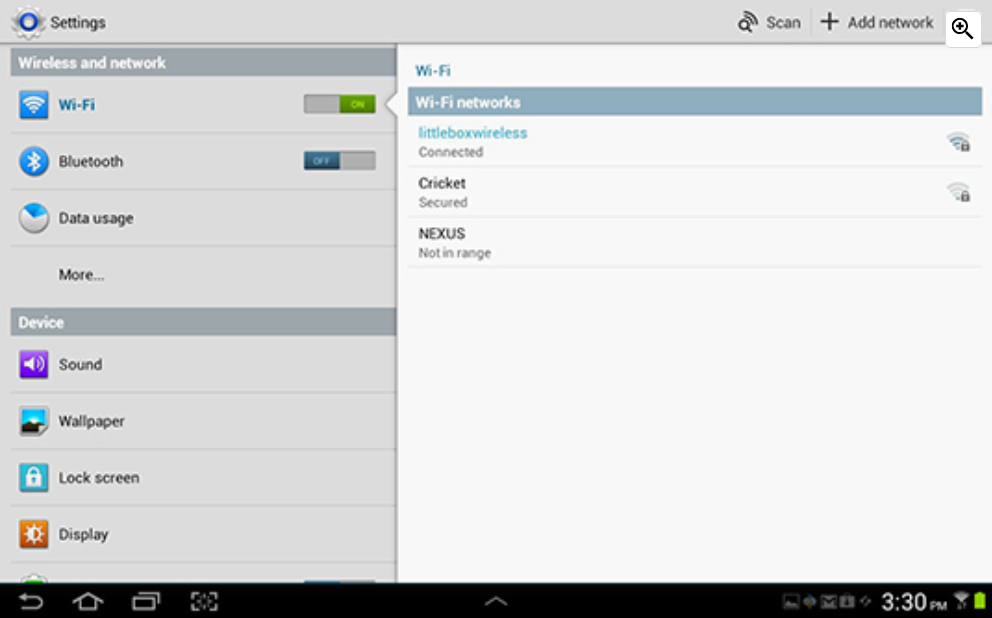
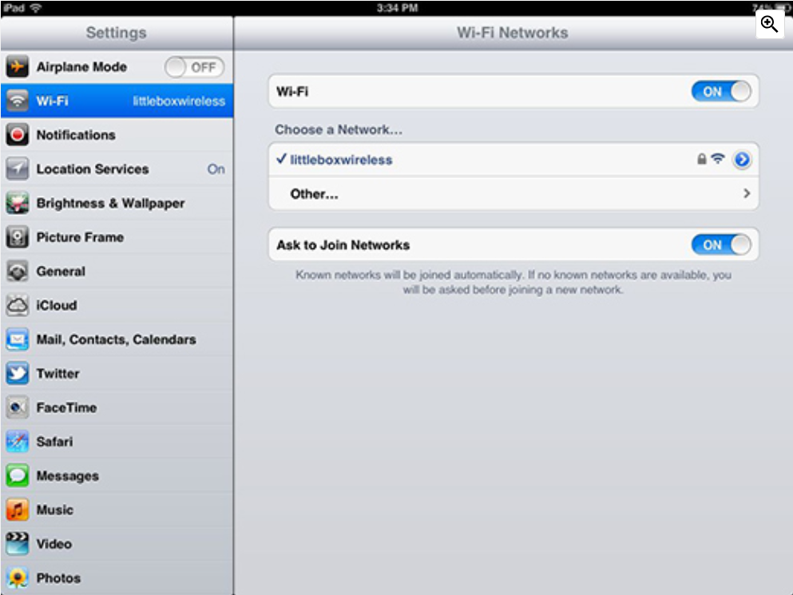

Two of the most popular operating systems for mobile devices are Android and Apple iOS. Each operating system has settings that enable you to configure your device to connect to wireless networks.

**Android WiFi Switch**

**IOS WiFi Switch**

To connect an Android or iOS device when it is within the coverage range of a Wi-Fi network, turn on Wi-Fi and the device then searches for all available Wi-Fi networks and displays them in a list. Touch a Wi-Fi network in the list to connect. Enter a password if needed.

When a mobile device is out of the range of the Wi-Fi network, it attempts to connect to another Wi-Fi network in range. If no Wi-Fi networks are in range, the mobile device connects to the cellular data network. When Wi-Fi is on, it will automatically connect to any Wi-Fi network that it has connected to previously. If the network is new, the mobile device either displays a list of available networks that can be used or asks if it should connect to it.

