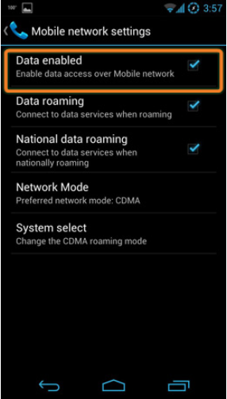
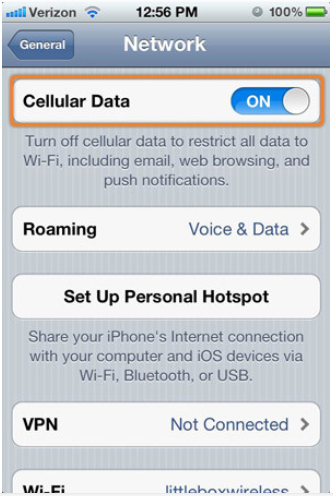

Cellular data plans are offered by most cell phone carriers, but the bandwidth limitations and charges for usage vary widely by carrier, and by plan within carriers. As a result, many mobile device users only use their cellular data plans when Wi-Fi service is not available.

**Android Cellular Data**

To turn on or off cellular data on an Android device, as shown in the figure, use the following path:

**Settings >** touch **More** under **Wireless and Networks >** touch **Mobile Networks >** touch **Data enabled**

**iOS Cellular Data**

To turn on or off cellular data on an iOS device, as shown in the figure, use the following path:

**Settings > Cellular Data >** turn cellular data on or off

Mobile devices are preprogrammed to use a Wi-Fi network for internet if one is available and the device can connect to the access point and receive an IP address. If no Wi-Fi network is available, the device uses the cellular data capability if it is configured. Most of the time, transitions from one network to another are not obvious to the user. For example, as a mobile device moves from an area of 4G coverage to 3G coverage, the 4G radio shuts off and turns on the 3G radio. Connections are not lost during this transition.

