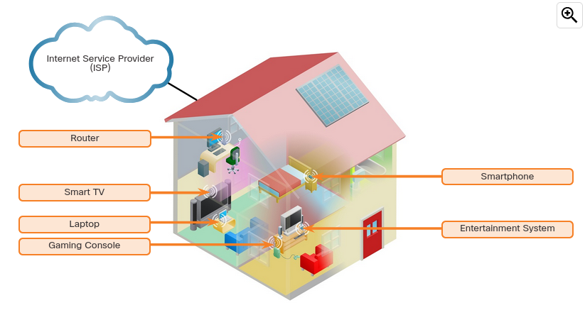

In addition to an integrated router, there are many different types of devices that might be connecting to a home network, as shown in the figure. Here are a few examples:

- Desktop computers
- Gaming systems
- Smart TV systems
- Printers
- Scanners
- Security cameras
- Telephones
- Climate control devices

As the new technologies come on the market, more and more household functions will rely on the network to provide connectivity and control.

**Home Wireless Local Area Network (WLAN)**

