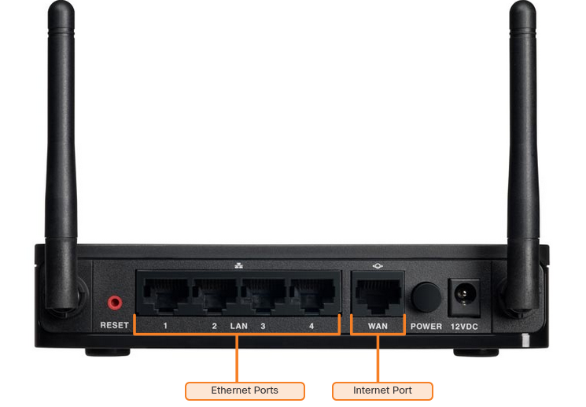

Small business and home routers typically have two primary types of ports:

**Ethernet Ports**
These ports connect to the internal switch portion of the router. These ports are usually labeled “Ethernet” or “LAN”, as shown in the figure. All devices connected to the switch ports are on the same local network.

**Internet Port**
This port is used to connect the device to another network. The internet port connects the router to a different network than the Ethernet ports. This port is often used to connect to the cable or DSL modem in order to access the internet.

In addition to the wired ports, many home routers include a radio antenna and a built-in wireless access point. By default, the wireless devices are on the same local network as the devices that are physically plugged into the LAN switch ports. The internet port is the only port that is on a different network in the default configuration.

