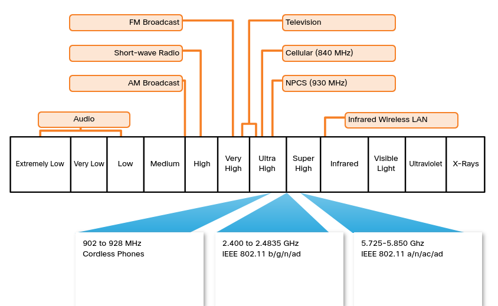

The wireless technologies most frequently used in home networks are in the unlicensed 2.4 GHz and 5 GHz frequency ranges.

Bluetooth is a technology that makes use of the 2.4 GHz band. It is limited to low-speed, short-range communications, but has the advantage of communicating with many devices at the same time. This one-to-many communication has made Bluetooth technology the preferred method for connecting computer peripherals such as wireless mice, keyboards and printers. Bluetooth is a good method for transmitting audio to speakers or headphones.

Other technologies that use the 2.4 GHz and 5 GHz bands are the modern wireless LAN technologies that conform to the various IEEE 802.11 standards. Unlike Bluetooth technology, 802.11 devices transmit at a much higher power level giving them a great range and improved throughput. Certain areas of the electromagnetic spectrum can be used without a permit.

The figure shows where wireless technologies exist on the electromagnetic spectrum.

