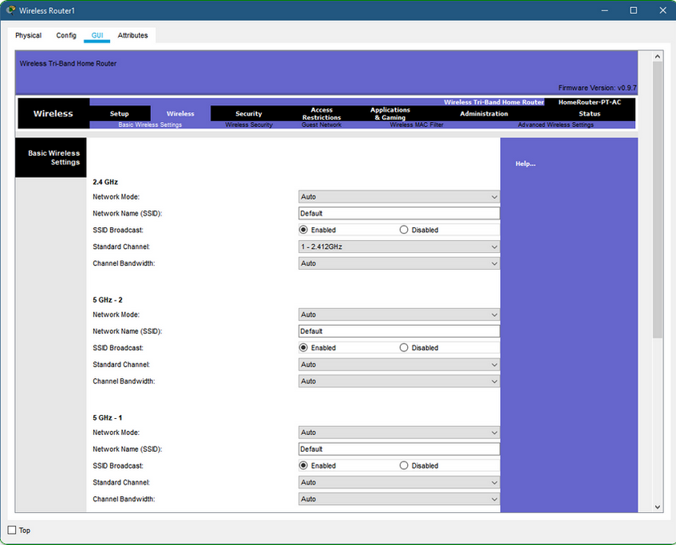

The Packet Tracer Basic Wireless Settings interface is shown in the figure. Wireless routers using the 802.11 standards have multiple settings that have to be configured. These settings include the following:

**Network Mode**
Determines the type of technology that must be supported. For example, **802.11b**,**802.11g**,**802.11n** or **Mixed Mode.**

**Network Name (SSID)**
Used to identify the WLAN. All devices that wish to participate in the WLAN must have the same SSID.

**Standard Channel**
Specifies the channel over which communication will occur. By default, this is set to **Auto** to allow the access point (AP) to determine the optimum channel to use.

**SSID Broadcast**
Determines if the SSID will be broadcast to all devices within range. By default, set to **Enabled**.

**Note:** SSID stands for Service Set Identifier.

**Network Mode**

The 802.11 protocol can provide increased throughput based on the wireless network environment. If all wireless devices connect with the same 802.11 standard, maximum speeds can be obtained for that standard. If the access point is configured to accept only one 802.11 standard, devices that do not use that standard cannot connect to the access point.

A mixed mode wireless network environment can include devices that use any of the existing Wi-Fi standards. This environment provides easy access for older devices that need a wireless connection but do not support the latest standards.

When building a wireless network, it is important that the wireless components connect to the appropriate WLAN. This is done using the SSID.

The SSID is a case-sensitive, alphanumeric string that contains up to 32 characters. It is sent in the header of all frames transmitted over the WLAN. The SSID is used to tell wireless devices, called wireless stations (STAs), which WLAN they belong to and with which other devices they can communicate.

We use the SSID to identify a specific wireless network. It is essentially the name of the network. Wireless routers usually broadcast their configured SSIDs by default. The SSID broadcast allows other devices and wireless clients to automatically discover the name of the wireless network. When the SSID broadcast is disabled, you must manually enter the SSID on wireless devices.

Disabling SSID broadcasting can make it more difficult for legitimate clients to find the wireless network. However, simply turning off the SSID broadcast is not sufficient to prevent unauthorised clients from connecting to the wireless network. All wireless networks should use the strongest available encryption to restrict unauthorised access.

